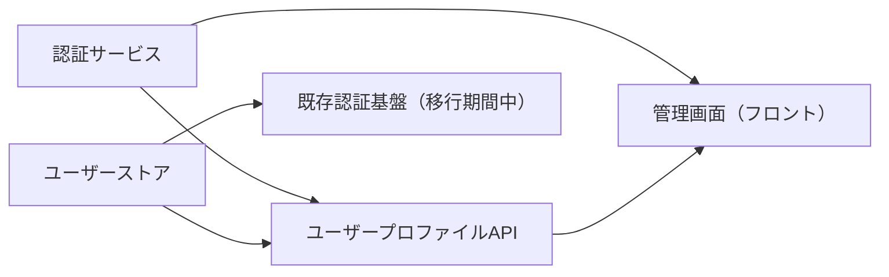

# システムアーキテクチャ

**タイプ:** 🏗 アーキテクチャ | **ステータス:** 🔄 WIP | **バージョン:** 1.0.0
**作成者:** 山田太郎
**この doc_type の役割:** システム全体像・コンポーネント境界を明文化する。

## 背景

現行のユーザー管理システムは認証・認可が独自実装で、OAuth 2.0 非対応のため
他システム連携やモバイル対応に不利。新認証基盤とユーザープロファイルAPIを
コンポーネント境界を明確にした形で再設計する。

## 目的

要件と実装の間の全体像・コンポーネント境界を明文化し、
認証・ユーザー管理・管理画面の責務分離を図る。

### 関連ドキュメント

- [要件整理](../../requirements/human/document.md)
- [WBS](../../../overview/wbs/human/document.md)

## スコープ

### スコープ内
- 認証サービス（トークン発行・リフレッシュ・検証）
- ユーザープロファイルAPI・管理画面

### スコープ外
- 課金システム連携（別プロジェクト）
- モバイルアプリ（フェーズ2）

## コンポーネント一覧

| ID | 名前 | 責務 |
|----|------|------|
| C-001 | 認証サービス | ログイン/ログアウト、アクセストークン・リフレッシュトークンの発行・ローテーション、セッション無効化 |
| C-002 | ユーザーストア | ユーザー・認証情報のCRUD、パスワードハッシュ・トークンストアの管理 |
| C-003 | ユーザープロファイルAPI | ユーザー一覧・詳細取得・更新API、認証サービスからのトークン検証結果に基づく認可 |
| C-004 | 管理画面（フロント） | ログイン画面、ユーザー一覧・編集画面、認証サービス・ユーザープロファイルAPIを呼び出し |
| C-005 | 既存認証基盤（移行期間中） | 既存クライアント向けセッション維持。新認証への移行後は廃止予定 |

### C-001: 認証サービス

OAuth 2.0 / OIDC 準拠のトークン発行・検証・リフレッシュを担当

**責務:** ログイン/ログアウト、アクセストークン・リフレッシュトークンの発行・ローテーション、セッション無効化

### C-002: ユーザーストア

ユーザー情報・認証情報を永続化するデータ層

**責務:** ユーザー・認証情報のCRUD、パスワードハッシュ・トークンストアの管理

### C-003: ユーザープロファイルAPI

ユーザー属性の取得・更新を提供するAPI層

**責務:** ユーザー一覧・詳細取得・更新API、認証サービスからのトークン検証結果に基づく認可
**依存:** C-001, C-002

### C-004: 管理画面（フロント）

管理者・オペレーター向けWebUI

**責務:** ログイン画面、ユーザー一覧・編集画面、認証サービス・ユーザープロファイルAPIを呼び出し
**依存:** C-001, C-003

### C-005: 既存認証基盤（移行期間中）

現行のセッション方式を提供。移行完了まで併存

**責務:** 既存クライアント向けセッション維持。新認証への移行後は廃止予定
**依存:** C-002

## 関連資料（エビデンス）

- [要件整理](../../requirements/human/document.md)
- [データモデル](../../data_model/human/document.md)
- [API仕様](../../api_spec/human/document.md)

---

[プロジェクト概要に戻る](../../../overview/project_summary/human/document.md)