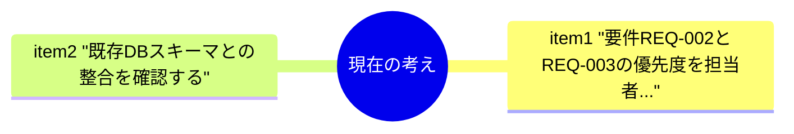
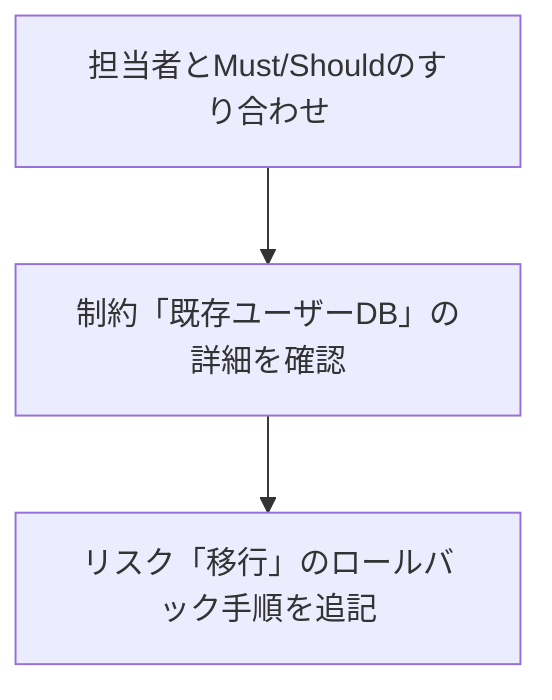
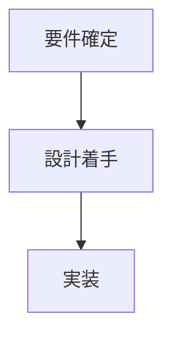
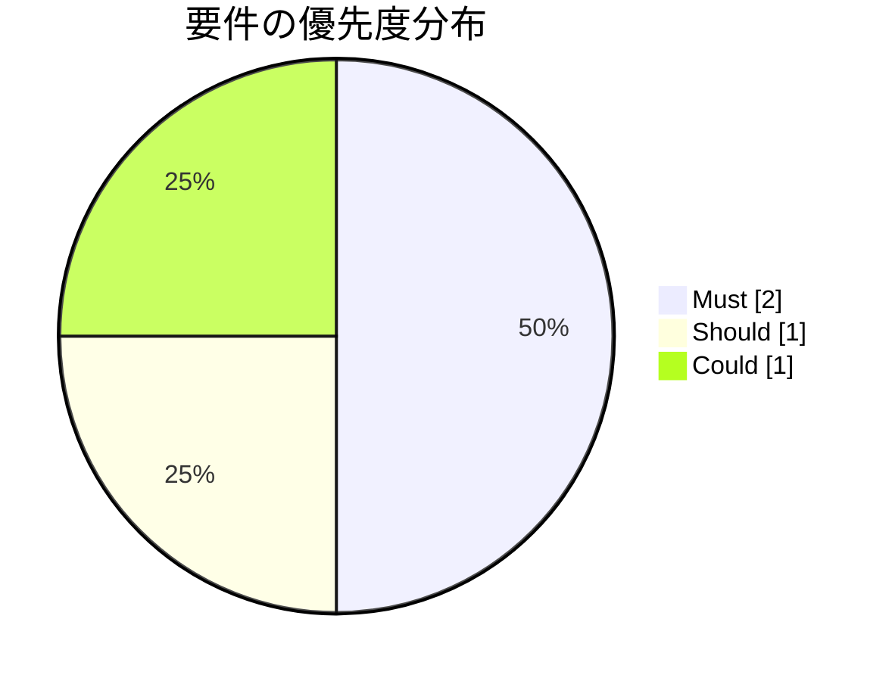
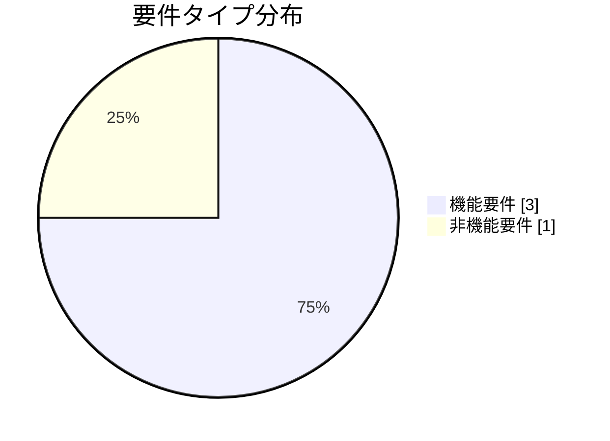

# ユーザー認証機能の要件整理

**タイプ:** 📋 要件整理 | **ステータス:** 🔄 WIP | **バージョン:** 1.0.0
**作成者:** 山田太郎
**作成日:** 2024-01-20
**この doc_type の役割:** 要件を整理し、優先度・受け入れ条件を明示する。

## AIの現在の考え

- 要件REQ-002とREQ-003の優先度を担当者とすり合わせる必要がある
- 既存DBスキーマとの整合を確認する

## これからのアクション

- 担当者とMust/Shouldのすり合わせ
- 制約「既存ユーザーDB」の詳細を確認
- リスク「移行」のロールバック手順を追記

## 判断・進め方の流れ

## 背景

現行システムの認証機能はセキュリティ要件を満たしていないため、
OAuth 2.0準拠の新認証機能を実装する必要がある。

## 目的

セキュアで使いやすい認証機能を提供し、
ユーザー体験を向上させる。

## スコープ

### スコープ内
- ログイン/ログアウト機能
- パスワードリセット機能
- 二要素認証

### スコープ外
- ソーシャルログイン（フェーズ2）
- 生体認証（将来検討）

## 要件一覧

| ID | 種類 | 優先度 | 説明 |
|----|------|--------|------|
| REQ-001 | 機能 | 🔴 Must | ユーザーはメールアドレスとパスワードでログインできる |
| REQ-002 | 非機能 | 🔴 Must | パスワードは8文字以上で英数字記号を含む必要がある |
| REQ-003 | 機能 | 🟠 Should | ログイン失敗が5回続くとアカウントが一時ロックされる |
| REQ-004 | 機能 | 🟡 Could | 二要素認証をオプションで有効化できる |

### REQ-001 受け入れ条件

- [ ] 有効な認証情報でログインできる
- [ ] 無効な認証情報でエラーメッセージが表示される
- [ ] ログイン後、ダッシュボードにリダイレクトされる

### REQ-002 受け入れ条件

- [ ] 8文字未満のパスワードは拒否される
- [ ] 英字のみのパスワードは拒否される
- [ ] 条件を満たすパスワードは受け入れられる

### REQ-003 受け入れ条件

- [ ] 5回連続失敗でロックされる
- [ ] ロック中はログインできない
- [ ] 30分後に自動解除される

### REQ-004 受け入れ条件

- [ ] 設定画面から2FAを有効化できる
- [ ] TOTP（Google Authenticator等）に対応
- [ ] バックアップコードを発行できる

## 制約条件

- 🔧 **technical**: 既存のユーザーDBスキーマとの互換性を維持
- ⏰ **time**: Q2末までにリリース必須
- 👥 **resource**: 開発者2名で対応

## リスク

| リスク | 影響度 | 対策 |
|--------|--------|------|
| 既存ユーザーの移行で問題が発生する可能性 | 🔴 high | 段階的移行とロールバック計画を準備 |
| 2FA導入によるサポート問い合わせ増加 | 🟡 medium | FAQとヘルプドキュメントを整備 |

## 関連資料（エビデンス）

- [OAuth 2.0 仕様](https://oauth.net/2/)
- [OWASP認証チートシート](https://cheatsheetseries.owasp.org/cheatsheets/Authentication_Cheat_Sheet.html)

---

[プロジェクト概要に戻る](../../../overview/project_summary/human/document.md)