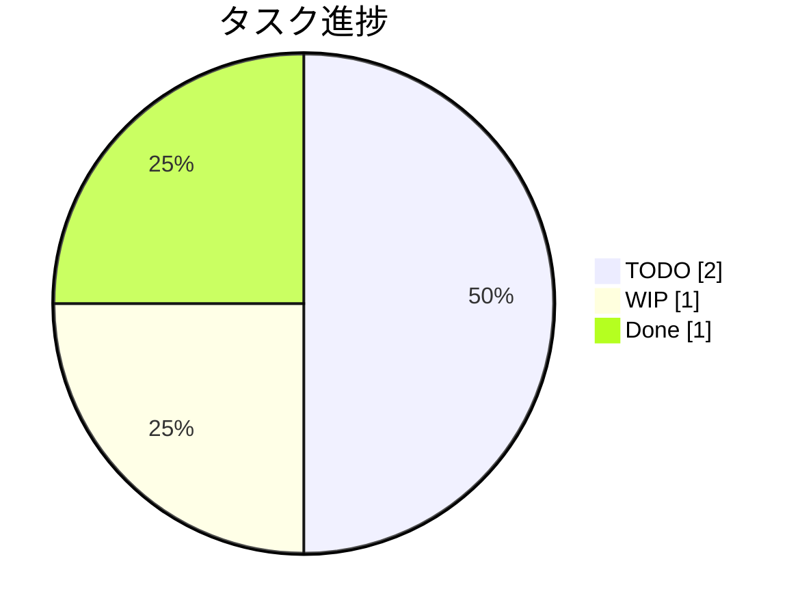
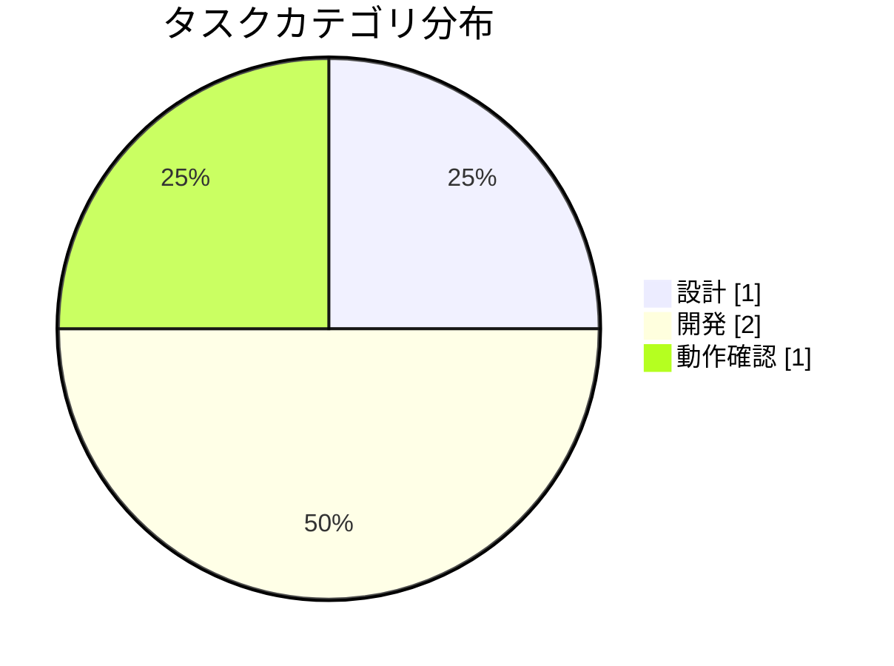
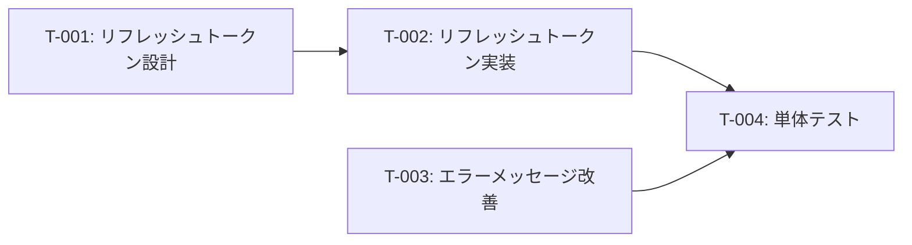

# 認証機能改修タスク分解

**タイプ:** 📝 タスク分解 | **ステータス:** 🔄 WIP | **バージョン:** 1.0.0
**作成者:** 山田太郎

## 背景

認証機能のセキュリティ改善が必要。

## 目的

セキュリティ要件を満たす認証機能を実装する。

## タスク一覧

| ID | タスク | カテゴリ | 優先度 | ステータス | 見積(h) |
|----|--------|----------|--------|----------|---------|
| T-001 | リフレッシュトークン設計 | 設計 | 🔴 high | ✅ done | 4 |
| T-002 | リフレッシュトークン実装 | 開発 | 🔴 high | 🔄 wip | 8 |
| T-003 | エラーメッセージ改善 | 開発 | 🔴 high | ⬜ todo | 2 |
| T-004 | 単体テスト | 動作確認 | 🔴 high | ⬜ todo | 4 |

### T-001: リフレッシュトークン設計

リフレッシュトークンのローテーション方式を設計する。

### T-002: リフレッシュトークン実装

**依存:** T-001

### T-004: 単体テスト

**依存:** T-002, T-003

## 制約条件

- ⏰ **time**: 2週間以内にリリース

## リスク

| リスク | 影響度 | 対策 |
|--------|--------|------|
| 既存クライアントへの影響 | 🔴 high | 移行期間を設ける |
