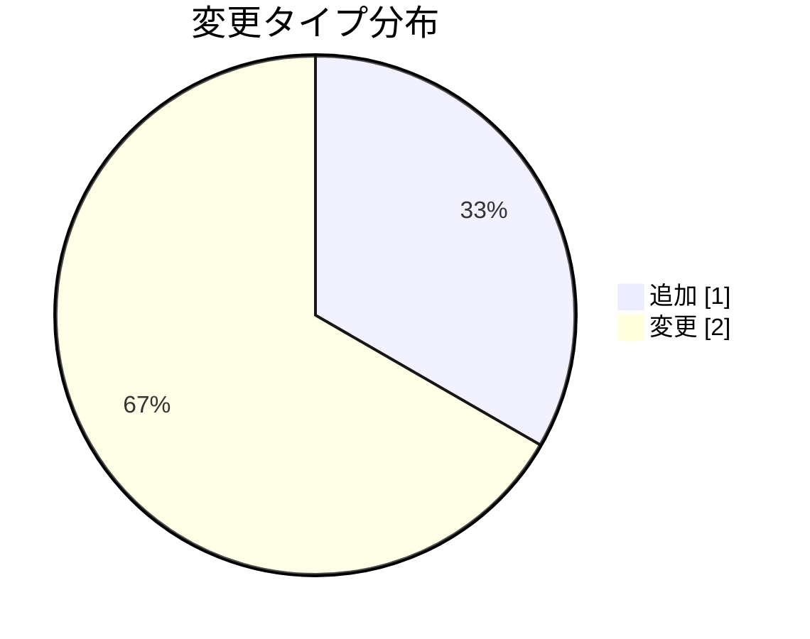

# セッション管理の実装詳細

**タイプ:** 📝 実装詳細 | **ステータス:** ✅ Done | **バージョン:** 1.0.0
**作成者:** 山田太郎

## 背景

既存のインメモリセッション管理ではスケール時に課題があった。


## 目的

この資料ではセッション管理をRedisベースに移行した実装の詳細を説明する。


### 関連ドキュメント

- [セッション管理実装計画](../../implementation_plan/human/document.md)

## 概要

セッション管理をRedisベースに移行し、
スケーラビリティとパフォーマンスを改善する。


**関連計画:** categories/development/implementation_plan/ai/document.yaml

## 変更内容



### ✏️ `src/auth/session.ts`

SessionManagerクラスをRedisクライアントを使用するように変更。
従来のインメモリストレージからRedisに移行。


**Before:**
```
class SessionManager {
  private sessions: Map<string, Session> = new Map();
  
  async createSession(userId: string): Promise<string> {
    const sessionId = uuid();
    this.sessions.set(sessionId, { userId, createdAt: Date.now() });
    return sessionId;
  }
}

```

**After:**
```
class SessionManager {
  private redis: RedisClient;
  
  constructor(redis: RedisClient) {
    this.redis = redis;
  }
  
  async createSession(userId: string): Promise<string> {
    const sessionId = uuid();
    await this.redis.set(
      `session:${sessionId}`,
      JSON.stringify({ userId, createdAt: Date.now() }),
      'EX',
      3600
    );
    return sessionId;
  }
}

```

### ➕ `src/config/redis.ts`

Redis接続設定を追加

**After:**
```
import Redis from 'ioredis';

export const redis = new Redis({
  host: process.env.REDIS_HOST || 'localhost',
  port: parseInt(process.env.REDIS_PORT || '6379'),
  password: process.env.REDIS_PASSWORD,
});

```

### ✏️ `src/auth/index.ts`

SessionManagerの初期化をDI対応に変更

## メモ

- Redisの接続プールサイズはデフォルト10に設定
- セッションTTLは環境変数で設定可能にした
- 既存のテストケースは全てパス

## 関連資料（エビデンス）

- [実装計画・関連Issue](https://github.com)

---

[プロジェクト概要に戻る](../../../overview/project_summary/human/document.md)