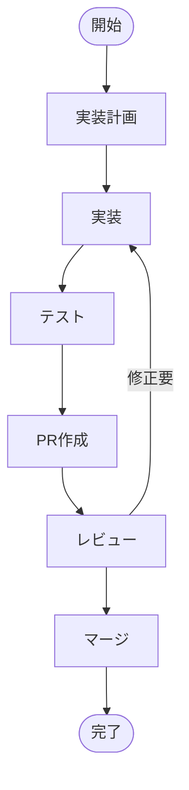
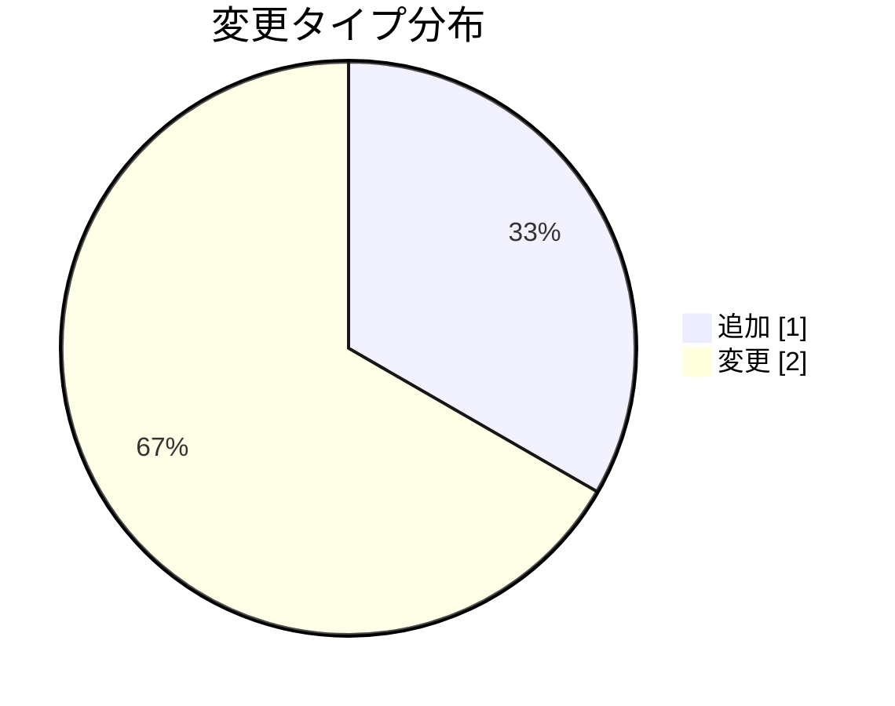

# リフレッシュトークンローテーション実装計画

**タイプ:** 📋 実装計画 | **ステータス:** 🔄 WIP | **対象:** 🌐 API | **バージョン:** 1.0.0
**作成者:** 山田太郎

## 開発フロー

## 背景

認証機能の調査で、リフレッシュトークンのローテーションが未実装であることが判明。

## 目的

リフレッシュトークンのローテーションを実装し、トークン漏洩時のリスクを軽減する。

### 関連ドキュメント

- [認証機能コード理解](investigation/code_understanding_auth.yaml)
- [認証WBS](overview/wbs_auth.yaml)

## 対象

**エンドポイント:** `POST /api/auth/refresh`

リフレッシュトークンを使用して新しいアクセストークンを取得するエンドポイント。

## 実装アプローチ

1. リフレッシュトークン使用時に新しいトークンペアを発行
2. 使用済みトークンを無効化
3. トークンファミリーを管理し、不正使用を検出

### デザインパターン
- Token Family Pattern
- Repository Pattern

### 使用技術
- TypeScript
- Redis
- JWT

## 変更内容

### ✏️ `src/auth/token.ts`

リフレッシュトークン生成時にファミリーIDを付与。
ローテーション時に新トークンを発行し、旧トークンを無効化。

### ➕ `src/auth/tokenStore.ts`

トークンの使用状態とファミリー管理を行うストア。

### ✏️ `src/types/token.ts`

トークンペイロードにfamilyIdを追加。

## テスト

### ユニットテスト
- [ ] 正常系: 新トークンペアを取得できる
- [ ] 異常系: 使用済みトークンでエラー
- [ ] 異常系: トークン再利用時にファミリー全体が無効化

### 結合テスト
- [ ] 認証フロー全体のE2Eテスト

## リスク

| リスク | 影響度 | 対策 |
|--------|--------|------|
| 既存クライアントがローテーションに対応していない | 🔴 high | 移行期間を設け、旧方式も一定期間サポート |
| Redisダウン時にトークン検証ができない | 🟡 medium | Redis Cluster使用、フォールバック処理 |

## 関連資料（エビデンス）

- [RFC 6749 - OAuth 2.0](https://tools.ietf.org/html/rfc6749)