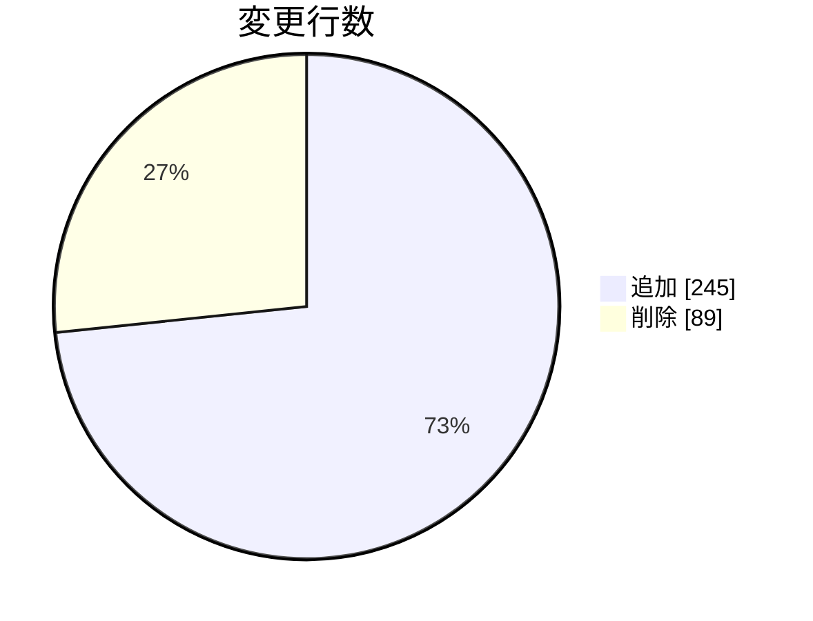

# セッション管理改善の修正結果

**タイプ:** ✅ 修正結果 | **ステータス:** ✅ Done | **バージョン:** 1.0.0
**作成者:** 山田太郎

**関連計画:** implementation_plan/session_management.yaml
**関連PR:** https://github.com/example/project/pull/123

## 修正結果

セッション管理をRedisベースに移行完了。
パフォーマンステストでは応答時間が40%改善された。

**変更ファイル:** 8 | **追加行:** +245 | **削除行:** -89

### コミット履歴

- `abc1234` feat: Add Redis client configuration
- `def5678` refactor: Migrate SessionManager to Redis
- `ghi9012` test: Add Redis session tests
- `jkl3456` docs: Update session management documentation

## 発見した問題

### Redis接続タイムアウトが短すぎた

**解決方法:** タイムアウト値を5秒から30秒に変更

### セッション削除時にエラーハンドリングが不足

**解決方法:** try-catchでエラーをキャッチしログ出力するように修正

## 学び

- Redisの接続設定は環境ごとに異なるため、早めに各環境で検証すべき
- セッションのシリアライズ形式は最初に決めておくと後の変更が楽
- パフォーマンステストは本番に近い環境で実施することが重要
