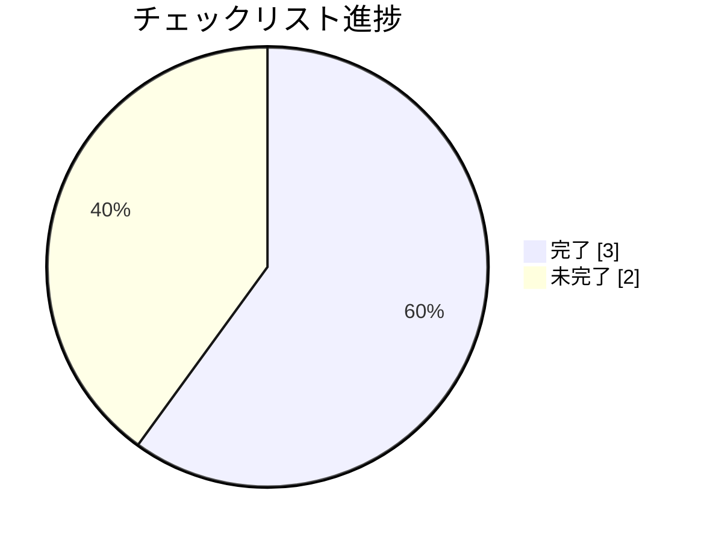

# リフレッシュトークンローテーション PR

**タイプ:** 🔀 PR情報 | **ステータス:** 🔄 WIP | **バージョン:** 1.0.0
**作成者:** 山田太郎
**この doc_type の役割:** PR の概要・変更内容・レビュー観点を記録する。

## Pull Request

**URL:** https://github.com/example/auth-service/pull/456
**タイトル:** feat: implement refresh token rotation
**ブランチ:** `feature/token-rotation` → `develop`

### 説明

## 概要
リフレッシュトークンのローテーションを実装します。

## 変更内容
- トークン発行時にファミリーIDを付与
- トークン使用時に新しいペアを発行し、旧トークンを無効化
- トークン再利用を検出してファミリー全体を無効化

## 関連Issue
- AUTH-123
- AUTH-456

**レビュアー:** sato, suzuki
**ラベル:** enhancement, security, ready for review

### チェックリスト

- ✅ セルフレビュー完了
- ✅ ユニットテスト追加
- ✅ 結合テスト追加
- ⬜ ドキュメント更新
- ⬜ 動作確認完了

## 背景

セキュリティ監査でリフレッシュトークンのローテーションが必要との指摘を受けた。

## 変更概要

- src/auth/token.ts: トークンローテーションロジック追加
- src/auth/tokenStore.ts: 新規追加、Redis連携
- src/types/token.ts: familyId追加

## テスト

### テスト済み
- ✅ ユニットテスト: 正常系トークンローテーション
- ✅ ユニットテスト: トークン再利用検出
- ✅ 結合テスト: 認証フロー全体

### 未テスト
- ⬜ 負荷テスト
- ⬜ 既存クライアントとの互換性テスト

## メモ

- 移行期間中は旧方式も並行サポート（フラグで切替可能）
- Redis接続エラー時のフォールバック処理はTODOコメントで残している

## 関連資料（エビデンス）

- [PR・関連Issue](https://github.com)

---

[プロジェクト概要に戻る](../../../overview/project_summary/human/document.md)