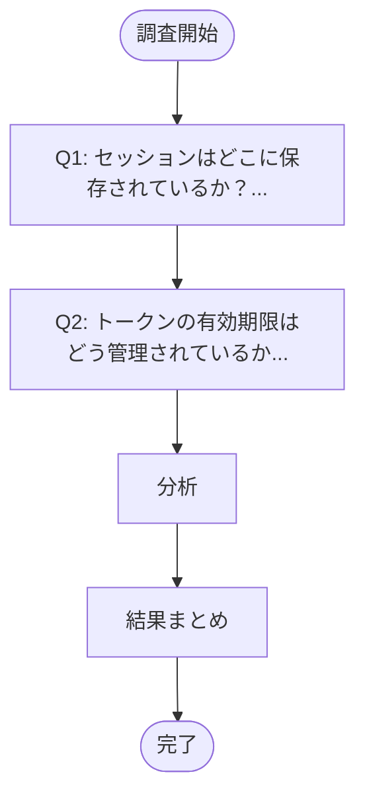
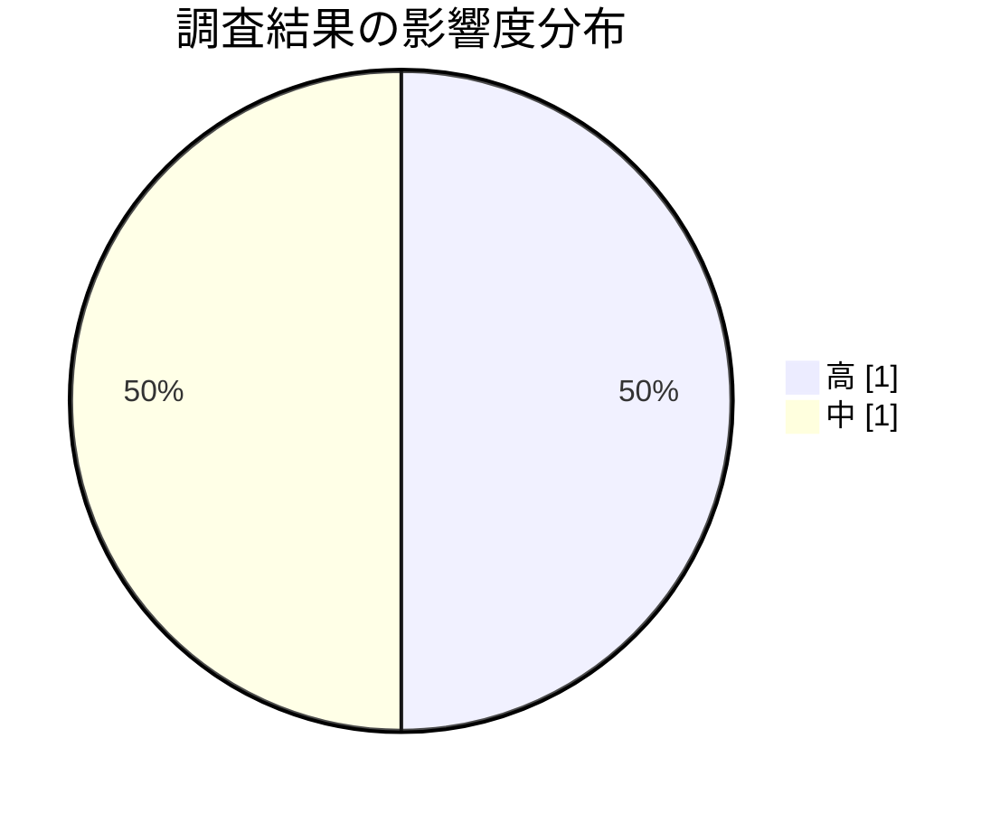

# 認証モジュールのコード理解

**タイプ:** 📖 コード理解 | **ステータス:** ✅ Done | **バージョン:** 1.0.0
**作成者:** 山田太郎

## 調査対象

ユーザー認証モジュールの現行実装を理解する。


**リポジトリ:** https://github.com/example/auth-service
**対象ファイル:**
- `src/auth/session.ts`
- `src/auth/token.ts`

**対象コンポーネント:**
- SessionManager
- TokenGenerator

## 調査項目



| ID | 質問 | 優先度 |
|----|------|--------|
| Q1 | セッションはどこに保存されているか？ | 🔴 high |
| Q2 | トークンの有効期限はどう管理されているか？ | 🔴 high |

## 調査結果



### 1. [Q1] セッションはRedisに保存されている。
SessionManagerクラスがRedisクライアント...

**影響度:** 🟡 中

セッションはRedisに保存されている。
SessionManagerクラスがRedisクライアントをラップしている。


**根拠:**
```
class SessionManager {
  private redis: RedisClient;
  async createSession(userId: string): Promise<string> {
    const sessionId = uuid();
    await this.redis.set(`session:${sessionId}`, userId, 'EX', 3600);
    return sessionId;
  }
}

```

### 2. [Q2] トークンはJWTで発行され、有効期限は1時間。
リフレッシュトークンのローテーションは未実装。
...

**影響度:** 🔴 高

トークンはJWTで発行され、有効期限は1時間。
リフレッシュトークンのローテーションは未実装。


**根拠:**
```
const accessToken = jwt.sign({ userId }, SECRET, { expiresIn: '1h' });

```

## 結論

- セッション管理はRedisベースで基本実装はできている
- トークン管理にセキュリティ上の課題がある

## 次のアクション

| 優先度 | アクション |
|--------|----------|
| 🔴 Must | リフレッシュトークンのローテーション実装を検討 |
| 🟠 Should | セッションタイムアウトの設定値をレビュー |

## 参考資料

- [JWT Best Practices](https://auth0.com/blog/jwt-best-practices/)
