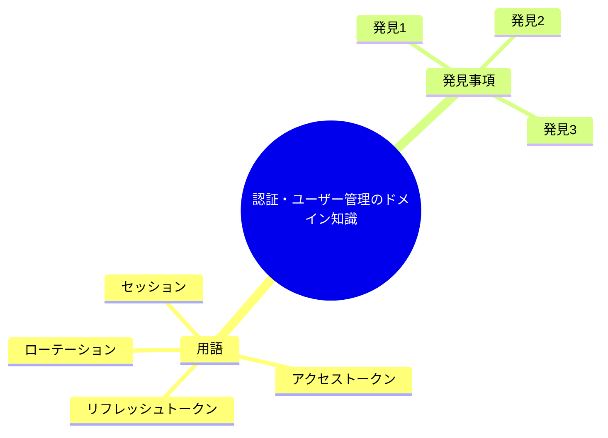

# 認証・ユーザー管理のドメイン知識

**タイプ:** 🧠 ドメイン知識 | **ステータス:** 🔄 WIP | **バージョン:** 1.0.0
**作成者:** 山田太郎
**この doc_type の役割:** ドメイン知識・業務理解の調査結果を記録する。

## 調査対象

ユーザー管理システム刷新にあたり、現行の認証・ユーザー管理の業務ルールと
ドメイン用語を整理する。

**ドメイン:** 認証・認可・ユーザー管理

## 用語集

| 用語 | 定義 |
|------|------|
| アクセストークン | API アクセス時に Bearer で提示する短期トークン。本プロジェクトでは JWT、有効期限 15 分〜1 時間を想定。 |
| リフレッシュトークン | 新しいアクセストークンを取得するための長期トークン。ローテーション方式で使用のたびに新トークンに更新。 |
| ローテーション | リフレッシュトークン使用時に新しいトークンペアを発行し、使用済みトークンを無効化する方式。 |
| セッション | 現行システムでは Redis に保存されるログイン状態。新方式ではトークンベースに移行し、移行期間中は併存。 |

## 調査項目

| ID | 質問 | 優先度 |
|----|------|--------|
| Q1 | ログイン失敗時のロック条件と解除方法は？ | 🔴 high |
| Q2 | 管理者・オペレーター・一般ユーザーの権限境界は？ | 🔴 high |
| Q3 | パスワードリセットの有効期限は？ | 🟡 medium |

## 調査結果

### 1. [Q1] ログイン失敗が5回連続でアカウントが一時ロック。30分で自動解除（REQ-003）。
手動解除は管理...

ログイン失敗が5回連続でアカウントが一時ロック。30分で自動解除（REQ-003）。
手動解除は管理者のみ。管理画面の「ユーザーロック解除」から実施。

**情報源:** 要件整理 REQ-003、現行運用ヒアリング

### 2. [Q2] admin は全操作・設定変更。operator はユーザー一覧・詳細の閲覧と一部編集（パスワードリ...

admin は全操作・設定変更。operator はユーザー一覧・詳細の閲覧と一部編集（パスワードリセット依頼等）。
user は自分のプロファイルのみ。管理画面の認可粒度（画面/操作）は U-002 で未確定。

**情報源:** 要件整理、設計 open_items

### 3. [Q3] パスワードリセットリンクの有効期限は 1 時間。リンク使用後は即無効化。
...

パスワードリセットリンクの有効期限は 1 時間。リンク使用後は即無効化。

**情報源:** 現行仕様書

## 結論

- 認証・ロック・パスワードリセットの業務ルールは要件に反映済み。設計では認可粒度（U-002）を確定する必要あり。
- 用語は概要カテゴリの用語集（glossary）と整合させる。

## 次のアクション

- 🔴 Must 設計で認可粒度（画面/操作）を決定し、U-002 をクローズする
- 🟠 Should 用語集に本調査の用語を反映する

## 関連資料（エビデンス）

- [要件整理](../../../design/requirements/human/document.md)
- [用語集](../../../overview/glossary/human/document.md)
- [調査サマリ](../../investigation_summary/human/document.md)

---

[プロジェクト概要に戻る](../../../overview/project_summary/human/document.md)