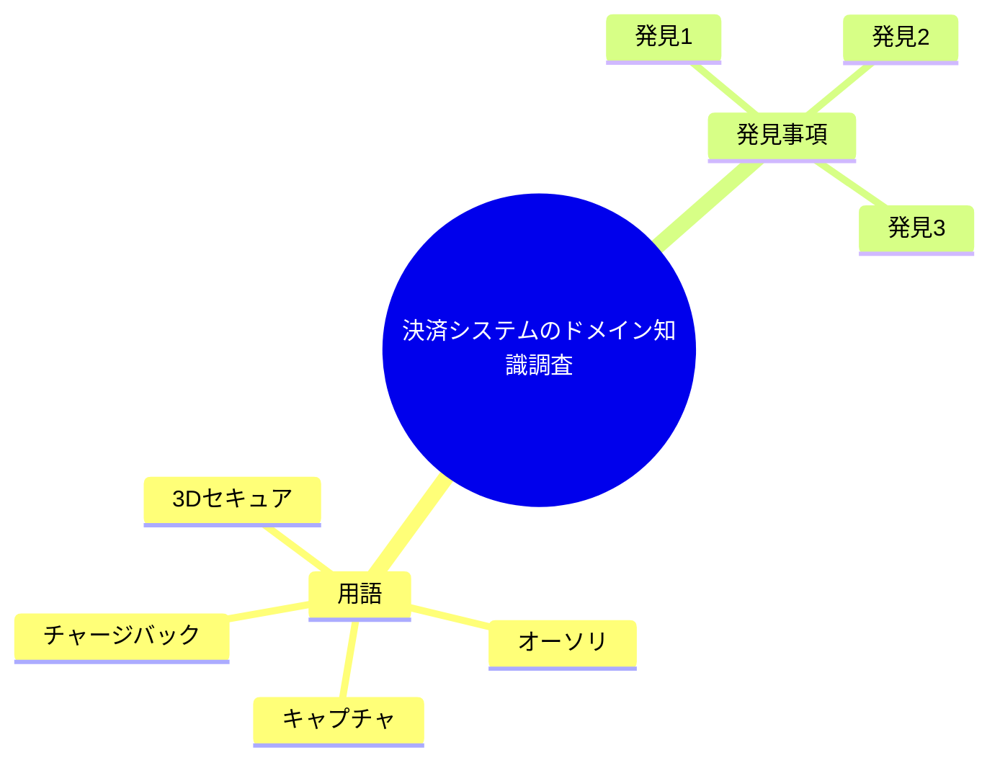

# 決済システムのドメイン知識調査

**タイプ:** 🧠 ドメイン知識 | **ステータス:** ✅ Done | **バージョン:** 1.0.0
**作成者:** 山田太郎

## 調査対象

決済システムの改修にあたり、現行の決済フローと
関連する業務ルールを理解する。

**ドメイン:** 決済・課金

## 用語集

| 用語 | 定義 |
|------|------|
| オーソリ | クレジットカードの与信枠確保。実際の請求前に利用可能かを確認する処理。 |
| キャプチャ | オーソリ済みの取引を確定し、実際に請求を行う処理。 |
| チャージバック | カード会社が売上を取り消し、加盟店に返金を求める処理。 |
| 3Dセキュア | オンライン決済での本人認証サービス。不正利用防止のため導入が推奨される。 |

## 調査項目

| ID | 質問 | 優先度 |
|----|------|--------|
| Q1 | 決済のキャンセル可能期間は？ | 🔴 high |
| Q2 | 部分返金は可能か？ | 🔴 high |
| Q3 | 決済手数料の計算ルールは？ | 🟡 medium |

## 調査結果

### 1. [Q1] 決済のキャンセルは、キャプチャ前であれば即座に可能。
キャプチャ後は返金処理となり、最大30日以内に...

決済のキャンセルは、キャプチャ前であれば即座に可能。
キャプチャ後は返金処理となり、最大30日以内に申請が必要。

**情報源:** 決済仕様書v2.1 3.4節

### 2. [Q2] 部分返金は対応している。ただし、同一取引に対する
部分返金は最大3回まで。
...

部分返金は対応している。ただし、同一取引に対する
部分返金は最大3回まで。

**情報源:** 経理部門ヒアリング

### 3. [Q3] 決済手数料は決済金額の3.6%。
月間決済額が1000万円を超える場合は3.2%に割引。
...

決済手数料は決済金額の3.6%。
月間決済額が1000万円を超える場合は3.2%に割引。

**情報源:** 決済代行会社契約書

## 結論

- 決済キャンセルはタイミングによって処理が異なるため、UIでの案内が重要
- 部分返金の回数制限はシステムでも制御が必要
- 手数料計算は月次バッチで再計算される仕組みが必要

## 次のアクション

- 🔴 Must 決済キャンセルフローの詳細設計
- 🟠 Should 部分返金回数のバリデーション実装
- 🟡 Could 手数料計算ロジックのレビュー

## 参考資料

- [決済仕様書v2.1](https://docs.internal/payment-spec-v2.1.pdf)
- [PCI DSS準拠ガイドライン](https://www.pcisecuritystandards.org/)
