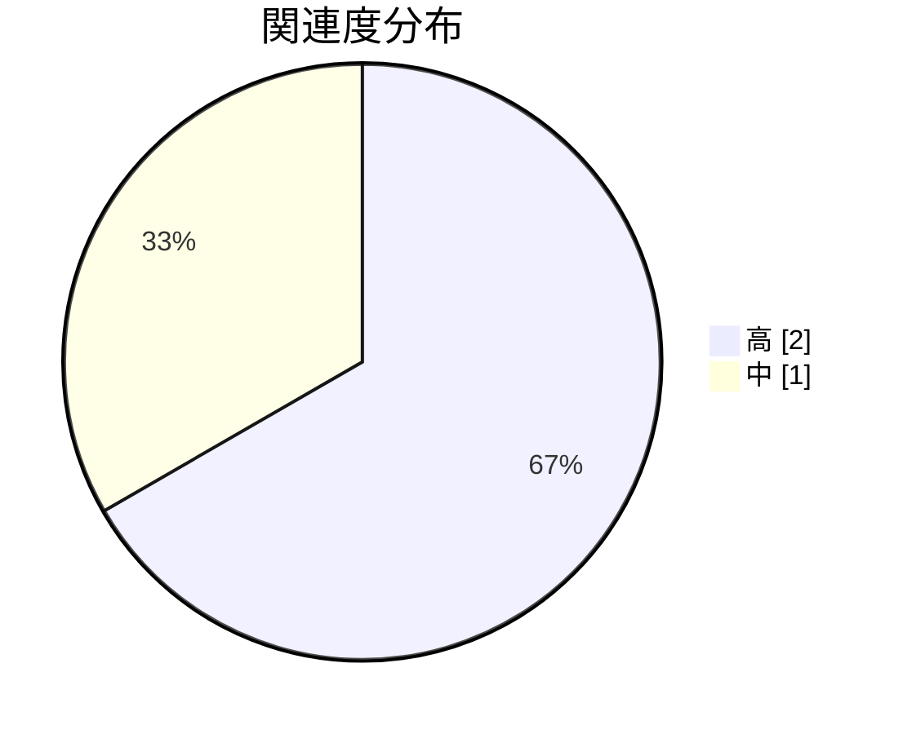

# 認証周辺の関連コード調査

**タイプ:** 🔍 関連コード調査 | **ステータス:** 🔄 WIP | **バージョン:** 1.0.0
**作成者:** 山田太郎
**この doc_type の役割:** 関連コードの調査結果を記録する。

## 調査対象

認証・ユーザー管理の改修にあたり、認証モジュールの呼び出し元および
ユーザーAPI周辺のコードを調査する。

**プロジェクトコンテキスト:** ユーザー管理システム刷新プロジェクト（認証機能改修）

**調査範囲:**
- src/auth/
- src/middleware/
- src/routes/users.ts
- src/routes/auth.ts

## 調査項目

| ID | 質問 | 優先度 |
|----|------|--------|
| Q1 | 認証ミドルウェアはどこで適用されているか？ | 🔴 high |
| Q2 | ユーザーAPIでトークン検証はどう行われているか？ | 🔴 high |

## 調査結果

### 1. [Q1] 各ルートで個別に tokenVerify() を呼んでいる。共通の requireAuth ミドルウ...

**関連度:** 🔴 高
**場所:** `src/routes/auth.ts, src/routes/users.ts`

各ルートで個別に tokenVerify() を呼んでいる。共通の requireAuth ミドルウェアは存在しない。
ルート追加時に検証の付け忘れが発生しうる。

### 2. [Q2] ユーザー一覧・詳細取得では、リクエストヘッダーから Bearer トークンを取り出し、
tokenV...

**関連度:** 🔴 高
**場所:** `src/routes/users.ts`

ユーザー一覧・詳細取得では、リクエストヘッダーから Bearer トークンを取り出し、
tokenVerify() で検証している。検証失敗時は 401 を返す。ロールによる認可は未実装。

### 3. [Q1] tokenVerify は JWT の署名・有効期限のみ検証。Redis でのトークン無効化（ログア...

**関連度:** 🟡 中
**場所:** `src/auth/token.ts`

tokenVerify は JWT の署名・有効期限のみ検証。Redis でのトークン無効化（ログアウト済み）は未チェック。

## 結論

- 認証ミドルウェアの共通化（requireAuth）を実装し、ルートではミドルウェアを適用するだけにする推奨（TD-002）。
- ログアウト済みトークンの無効化チェックは、Redis トークンストア実装時に追加する。

## 次のアクション

- 🔴 Must requireAuth ミドルウェアの設計・実装を実装計画に反映する
- 🟠 Should トークン無効化チェックをトークンストア実装と同時に追加する

## 関連資料（エビデンス）

- [認証モジュールのコード理解](../../code_understanding/human/document.md)
- [実装計画](../../../development/implementation_plan/human/document.md)
- [設計タスク](../../../design/tasks/human/document.md)

---

[プロジェクト概要に戻る](../../../overview/project_summary/human/document.md)