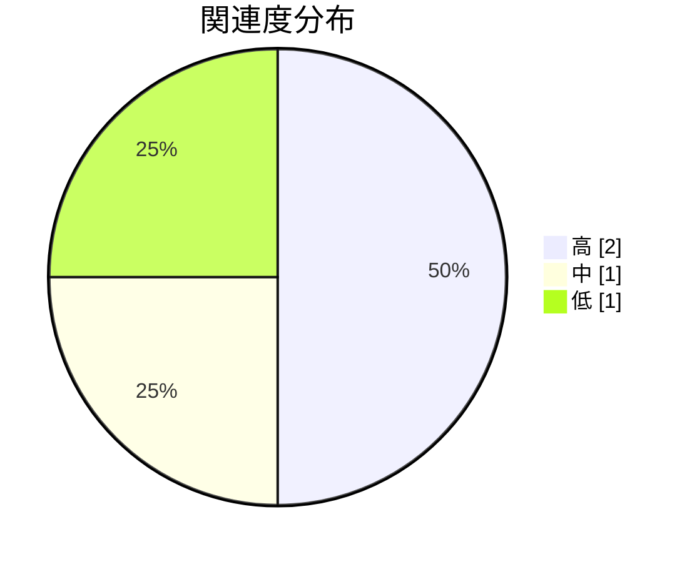

# 通知システムの関連コード調査

**タイプ:** 🔍 関連コード調査 | **ステータス:** ✅ Done | **バージョン:** 1.0.0
**作成者:** 山田太郎

## 調査対象

通知機能の改修にあたり、既存の通知関連コードを調査する。

**プロジェクトコンテキスト:** ユーザー通知システムのリアルタイム化プロジェクト

**調査範囲:**
- notification-service/
- shared/events/
- api-gateway/routes/notifications/

## 調査項目

| ID | 質問 | 優先度 |
|----|------|--------|
| Q1 | 現在の通知送信の仕組みは？ | 🔴 high |
| Q2 | 通知の永続化はどこで行われている？ | 🔴 high |
| Q3 | WebSocket対応の準備状況は？ | 🟡 medium |

## 調査結果

### 1. [Q1] 通知はSQSキューを経由して非同期で送信されている。
NotificationWorkerがキューを...

**関連度:** 🔴 高
**場所:** `notification-service/src/workers/notification-worker.ts`

通知はSQSキューを経由して非同期で送信されている。
NotificationWorkerがキューをポーリングしてメール/プッシュ通知を送信。

### 2. [Q1] 通知テンプレートはDynamoDBに保存されている。
テンプレートエンジンはHandlebarsを使...

**関連度:** 🟡 中
**場所:** `notification-service/src/templates/template-engine.ts`

通知テンプレートはDynamoDBに保存されている。
テンプレートエンジンはHandlebarsを使用。

### 3. [Q2] 通知履歴はPostgreSQLのnotificationsテーブルに保存。
既読/未読ステータスも同...

**関連度:** 🔴 高
**場所:** `notification-service/src/repositories/notification-repository.ts`

通知履歴はPostgreSQLのnotificationsテーブルに保存。
既読/未読ステータスも同テーブルで管理。

### 4. [Q3] WebSocketサーバーの雛形は存在するが、
現在は使用されていない（コメントアウト状態）。
...

**関連度:** 🟢 低
**場所:** `api-gateway/src/websocket/index.ts`

WebSocketサーバーの雛形は存在するが、
現在は使用されていない（コメントアウト状態）。

## 結論

- 通知送信は非同期処理で実装済み、リアルタイム化にはWebSocket層の追加が必要
- 通知の永続化層は再利用可能
- WebSocketの雛形があるため、これを拡張する形で実装可能

## 次のアクション

- 🔴 Must WebSocketサーバーの有効化と動作確認
- 🔴 Must 通知イベントのWebSocketブロードキャスト実装
- 🟠 Should 既存の非同期処理との統合設計
