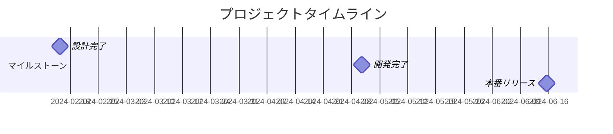
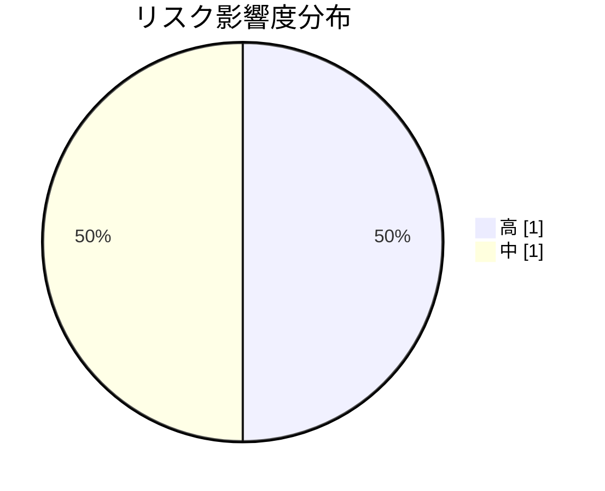

# ユーザー管理システム刷新プロジェクト

**ステータス:** 🔄 WIP | **バージョン:** 1.0.0
**作成者:** 山田太郎

## 背景

現行のユーザー管理システムは5年以上前に構築され、以下の課題を抱えている：
- パフォーマンスの低下
- セキュリティ要件への非対応
- 保守性の低下

## ゴール

モダンなアーキテクチャを採用した新ユーザー管理システムを構築し、
応答時間50%改善、OAuth 2.0対応を実現する。

## スコープ

### スコープ内
- ユーザー認証・認可機能の刷新
- ユーザープロファイル管理APIの再設計
- 管理画面のリニューアル

### スコープ外
- 課金システムとの連携（別プロジェクト）
- モバイルアプリ対応（フェーズ2）

## 成功基準

1. API応答時間が平均100ms以下
2. OAuth 2.0準拠

## ステークホルダー

| 名前 | 役割 | 連絡先 |
|------|------|--------|
| 鈴木一郎 | プロダクトオーナー | suzuki@example.com |
| 山田太郎 | テックリード | yamada@example.com |

## タイムライン

**期間:** 2024-01-15 ~ 2024-06-30

| マイルストーン | 日付 | 説明 |
|---------------|------|------|
| 設計完了 | 2024-02-15 | API設計、DB設計の完了 |
| 開発完了 | 2024-04-30 | 全機能の実装完了 |
| 本番リリース | 2024-06-15 | 本番環境への段階的リリース |

## 制約条件

- 🔧 **technical**: 既存の認証基盤との互換性を維持
- ⏰ **time**: 6月末までにリリース必須

## リスク

| リスク | 影響度 | 対策 |
|--------|--------|------|
| 既存データの移行で不整合が発生する可能性 | 🔴 high | 移行ツールの事前検証、段階的移行 |
| 開発遅延によるリリース日程への影響 | 🟡 medium | 週次進捗確認、バッファの確保 |

## カテゴリ別ドキュメント一覧

### overview

- [受入・サインオフ一覧](../acceptance_sign_off/human/document.md)
- [プロジェクト変更履歴](../change_log/human/document.md)
- [プロジェクト決定ログ](../decisions/human/document.md)
- [外部依存](../dependency_external/human/document.md)
- [用語集](../glossary/human/document.md)
- [振り返り・教訓](../lessons_learned/human/document.md)
- [案件全体の検討事項・不明点](../open_items/human/document.md)
- [品質・受入基準](../quality_criteria/human/document.md)
- [リリースログ](../release_log/human/document.md)
- [プロジェクトリスク登録簿](../risk_register/human/document.md)
- [ステークホルダー・RACI](../stakeholder_raci/human/document.md)
- [認証機能改修 WBS](../wbs/human/document.md)

### design

- [API仕様](../../../design/api_spec/human/document.md)
- [システムアーキテクチャ](../../../design/architecture/human/document.md)
- [データモデル](../../../design/data_model/human/document.md)
- [設計の検討事項・不明点](../../../design/open_items/human/document.md)
- [ユーザー認証機能の要件整理](../../../design/requirements/human/document.md)
- [セキュリティ設計・脅威モデル](../../../design/security_design/human/document.md)
- [設計の詳細タスク](../../../design/tasks/human/document.md)

### development

- [依存一覧](../../../development/dependencies/human/document.md)
- [環境・インフラ](../../../development/environment/human/document.md)
- [セッション管理の実装詳細](../../../development/implementation_detail/human/document.md)
- [リフレッシュトークンローテーション実装計画](../../../development/implementation_plan/human/document.md)
- [セッション管理改善の修正結果](../../../development/implementation_result/human/document.md)
- [障害・振り返り](../../../development/incident_postmortem/human/document.md)
- [開発の検討事項・不明点](../../../development/open_items/human/document.md)
- [リフレッシュトークンローテーション PR](../../../development/pull_request/human/document.md)
- [運用ランブック](../../../development/runbook/human/document.md)
- [開発の詳細タスク](../../../development/tasks/human/document.md)
- [技術的負債一覧](../../../development/technical_debt/human/document.md)

### investigation

- [認証モジュールのコード理解](../../../investigation/code_understanding/human/document.md)
- [決済システムのドメイン知識調査](../../../investigation/domain_knowledge/human/document.md)
- [調査の検討事項・不明点](../../../investigation/open_items/human/document.md)
- [通知システムの関連コード調査](../../../investigation/related_code_research/human/document.md)
- [調査の詳細タスク](../../../investigation/tasks/human/document.md)

### verification

- [検証の検討事項・不明点](../../../verification/open_items/human/document.md)
- [検証の詳細タスク](../../../verification/tasks/human/document.md)
- [ログイン機能の動作確認計画](../../../verification/verification_plan/human/document.md)
- [ログイン機能の動作確認手順](../../../verification/verification_procedure/human/document.md)
- [リフレッシュトークン実装 動作確認結果](../../../verification/verification_result/human/document.md)

## 関連資料（エビデンス）

- [OAuth 2.0 仕様](https://oauth.net/2/)