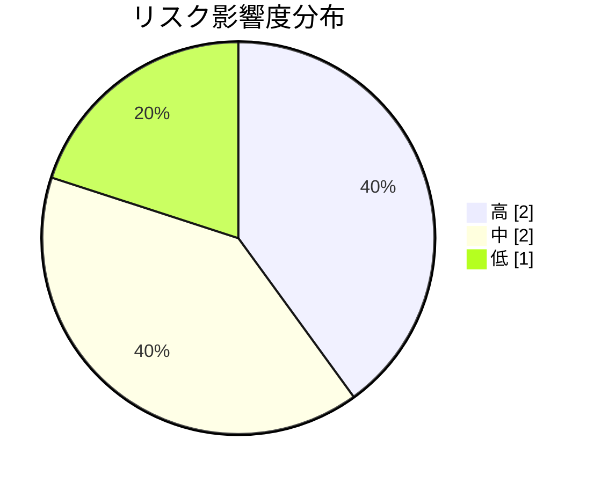

# プロジェクトリスク登録簿

**タイプ:** 📊 リスク登録簿 | **ステータス:** 🔄 WIP | **バージョン:** 1.0.0
**作成者:** 山田太郎
**この doc_type の役割:** プロジェクトリスクを登録し、影響度と対策を管理する。

## リスク一覧

| ID | リスク | 影響度 | 対策 | オーナー | 状態 | 識別日 |
|----|--------|--------|------|----------|------|--------|
| R-001 | 既存クライアント・他システムが新認証方式に未対応で移行が遅れる | 🔴 high | 移行期間を設け、旧セッション方式を並存。段階的カットオーバーとロールバック手順を事前に整備する。 | 山田太郎 | 🔄 対策中 | 2024-01-10 |
| R-002 | 既存データ移行時に不整合が発生する | 🔴 high | 移行ツールの事前検証、ステージングでのリハーサル、段階的移行で影響範囲を限定する。 | 山田太郎 | ⬜ 未対応 | 2024-01-10 |
| R-003 | 開発遅延によりリリース日程がずれる | 🟡 medium | 週次進捗確認、WBS のバッファ確保、スコープの優先度付けで必須機能に集中する。 | 鈴木一郎 | ⬜ 未対応 | 2024-01-12 |
| R-004 | 外部認証プロバイダ（将来のソーシャルログイン等）の障害でログイン不可になる | 🟡 medium | 第一フェーズでは自前認証のみ。外部連携時はフォールバック（メール/パスワード）を必ず残す方針とする。 | 山田太郎 | ✅ 対策済 | 2024-01-15 |
| R-005 | セキュリティ要件の解釈差により後から設計変更が発生する | 🟢 low | 要件・セキュリティ設計を早期にレビューし、PO・セキュリティ担当の合意を文書化する。 | 山田太郎 | ⬜ 未対応 | 2024-01-18 |

### R-001: 既存クライアント・他システムが新認証方式に未対応で移行が遅れる

**対策:** 移行期間を設け、旧セッション方式を並存。段階的カットオーバーとロールバック手順を事前に整備する。
**オーナー:** 山田太郎 / **識別日:** 2024-01-10

### R-002: 既存データ移行時に不整合が発生する

**対策:** 移行ツールの事前検証、ステージングでのリハーサル、段階的移行で影響範囲を限定する。
**オーナー:** 山田太郎 / **識別日:** 2024-01-10

### R-003: 開発遅延によりリリース日程がずれる

**対策:** 週次進捗確認、WBS のバッファ確保、スコープの優先度付けで必須機能に集中する。
**オーナー:** 鈴木一郎 / **識別日:** 2024-01-12

### R-004: 外部認証プロバイダ（将来のソーシャルログイン等）の障害でログイン不可になる

**対策:** 第一フェーズでは自前認証のみ。外部連携時はフォールバック（メール/パスワード）を必ず残す方針とする。
**オーナー:** 山田太郎 / **識別日:** 2024-01-15

### R-005: セキュリティ要件の解釈差により後から設計変更が発生する

**対策:** 要件・セキュリティ設計を早期にレビューし、PO・セキュリティ担当の合意を文書化する。
**オーナー:** 山田太郎 / **識別日:** 2024-01-18

## 関連資料（エビデンス）

- [プロジェクト概要](../../project_summary/human/document.md)
- [WBS](../../wbs/human/document.md)

---

[プロジェクト概要に戻る](../../project_summary/human/document.md)