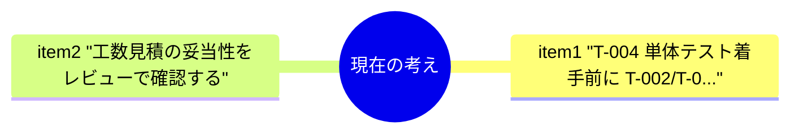
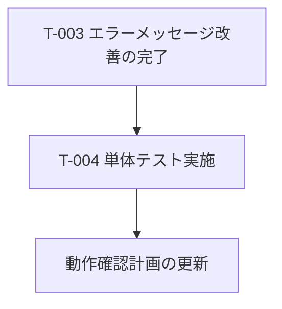
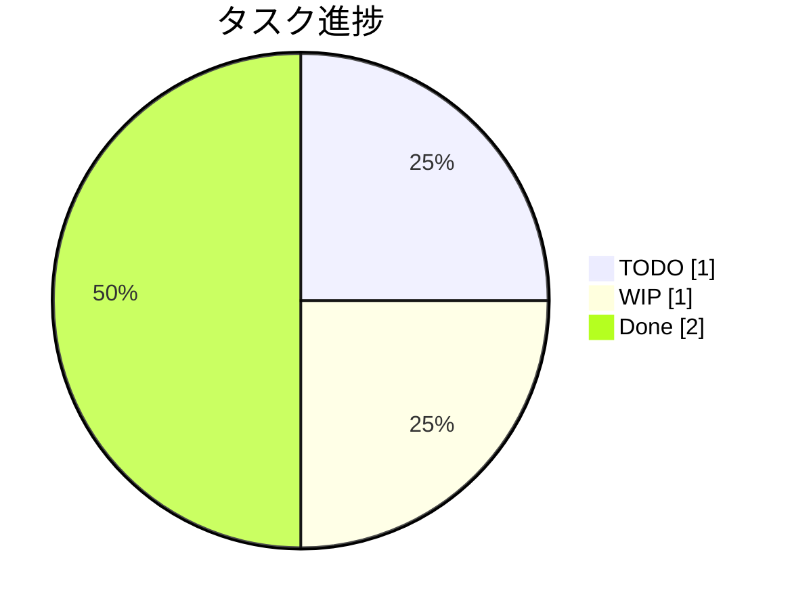
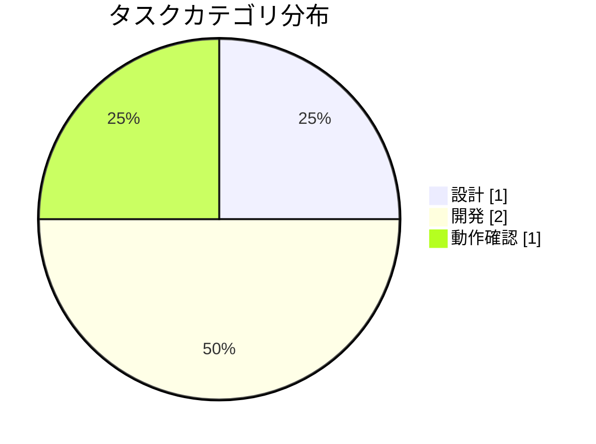
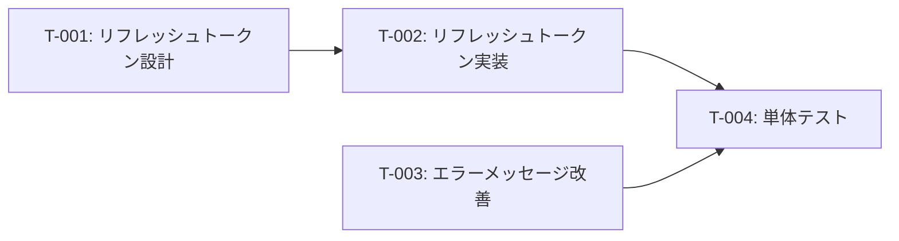

# 認証機能改修タスク分解

**タイプ:** 📝 タスク分解 | **ステータス:** 🔄 WIP | **バージョン:** 1.0.0
**作成者:** 山田太郎

## AIの現在の考え

- T-004 単体テスト着手前に T-002/T-003 の完了を確認する
- 工数見積の妥当性をレビューで確認する

## これからのアクション

- T-003 エラーメッセージ改善の完了
- T-004 単体テスト実施
- 動作確認計画の更新

## 背景

認証機能のセキュリティ改善が必要。

## 目的

セキュリティ要件を満たす認証機能を実装する。

## タスク一覧

| ID | タスク | カテゴリ | 優先度 | ステータス | 見積(h) |
|----|--------|----------|--------|----------|---------|
| T-001 | リフレッシュトークン設計 | 設計 | 🔴 high | ✅ done | 4 |
| T-002 | リフレッシュトークン実装 | 開発 | 🔴 high | ✅ done | 8 |
| T-003 | エラーメッセージ改善 | 開発 | 🔴 high | 🔄 wip | 2 |
| T-004 | 単体テスト | 動作確認 | 🔴 high | ⬜ todo | 4 |

### T-001: リフレッシュトークン設計

リフレッシュトークンのローテーション方式を設計する。

### T-002: リフレッシュトークン実装

**依存:** T-001

### T-004: 単体テスト

**依存:** T-002, T-003

## 制約条件

- ⏰ **time**: 2週間以内にリリース

## リスク

| リスク | 影響度 | 対策 |
|--------|--------|------|
| 既存クライアントへの影響 | 🔴 high | 移行期間を設ける |

## カテゴリ別タスク状態

overview / design / development / investigation / verification の各 `ai/document.yaml` のドキュメント状態と、
task_breakdown のタスク一覧を表示しています。

### overview / project_summary

- **タイトル:** ユーザー管理システム刷新プロジェクト
- **ドキュメント状態:** 🔄 WIP

### overview / task_breakdown

- **タイトル:** 認証機能改修タスク分解
- **ドキュメント状態:** 🔄 WIP

| ID | タイトル | 状態 |
|----|----------|------|
| T-001 | リフレッシュトークン設計 | ✅ Done |
| T-002 | リフレッシュトークン実装 | ✅ Done |
| T-003 | エラーメッセージ改善 | 🔄 WIP |
| T-004 | 単体テスト | ⬜ TODO |

### design / requirements

- **タイトル:** ユーザー認証機能の要件整理
- **ドキュメント状態:** 🔄 WIP

### development / implementation_detail

- **タイトル:** セッション管理の実装詳細
- **ドキュメント状態:** ✅ Done

### development / implementation_plan

- **タイトル:** リフレッシュトークンローテーション実装計画
- **ドキュメント状態:** 🔄 WIP

### development / implementation_result

- **タイトル:** セッション管理改善の修正結果
- **ドキュメント状態:** ✅ Done

### development / pull_request

- **タイトル:** リフレッシュトークンローテーション PR
- **ドキュメント状態:** 🔄 WIP

### investigation / code_understanding

- **タイトル:** 認証モジュールのコード理解
- **ドキュメント状態:** ✅ Done

### investigation / domain_knowledge

- **タイトル:** 決済システムのドメイン知識調査
- **ドキュメント状態:** ✅ Done

### investigation / related_code_research

- **タイトル:** 通知システムの関連コード調査
- **ドキュメント状態:** ✅ Done

### verification / verification_plan

- **タイトル:** ログイン機能の動作確認計画
- **ドキュメント状態:** 🔄 WIP

### verification / verification_procedure

- **タイトル:** ログイン機能の動作確認手順
- **ドキュメント状態:** 🔄 WIP

### verification / verification_result

- **タイトル:** リフレッシュトークン実装 動作確認結果
- **ドキュメント状態:** ✅ Done

## 関連資料（エビデンス）

- [プロジェクト概要・タスク一覧](https://github.com)