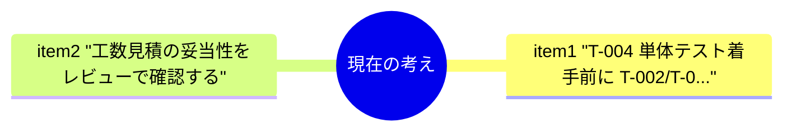
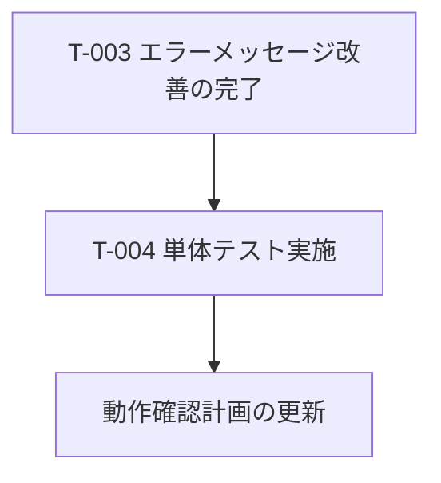
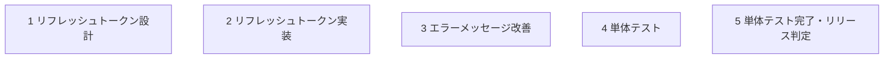
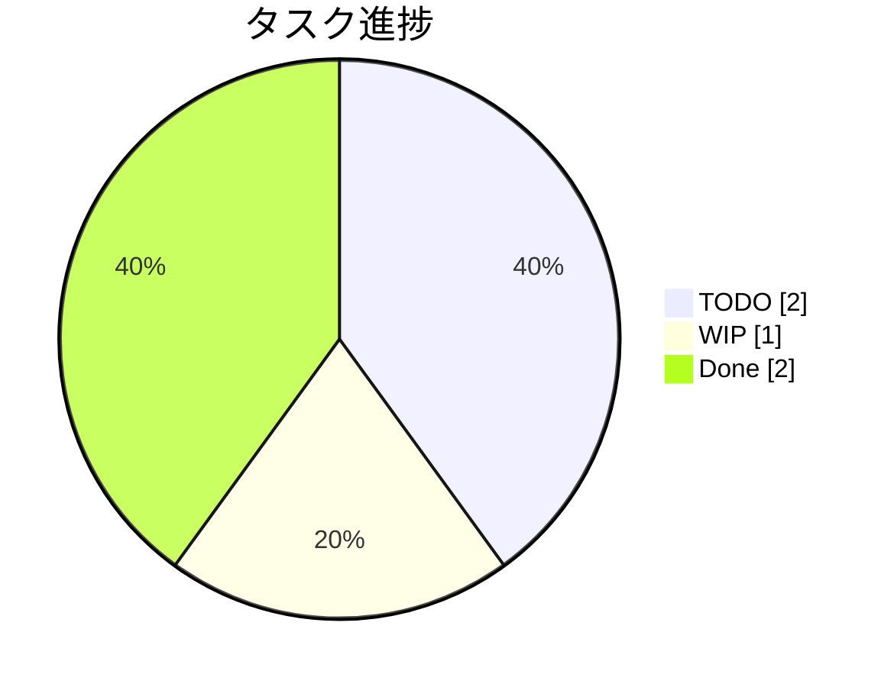
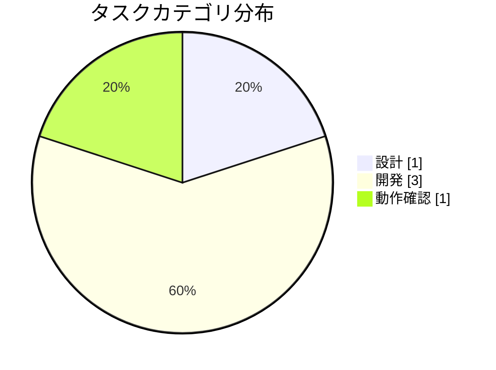
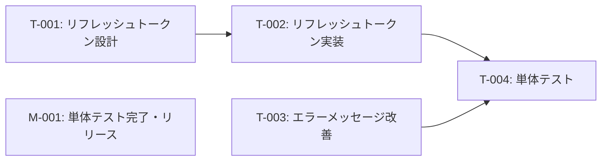

# 認証機能改修 WBS

**タイプ:** 📋 WBS（作業分解構成） | **ステータス:** 🔄 WIP | **バージョン:** 1.0.0
**作成者:** 山田太郎
**作成日:** 2024-01-20
**この doc_type の役割:** 作業分解構成とタスク・マイルストーンを管理する。

## AIの現在の考え

- T-004 単体テスト着手前に T-002/T-003 の完了を確認する
- 工数見積の妥当性をレビューで確認する

## これからのアクション

- T-003 エラーメッセージ改善の完了
- T-004 単体テスト実施
- 動作確認計画の更新

## 背景

認証機能のセキュリティ改善が必要。

## 目的

セキュリティ要件を満たす認証機能を実装する。

## ゴールまでの状況

セキュリティ要件を満たす認証機能を実装する。

- **全体進捗（タスク数）:** 2/5 タスク = **40%**
- **全体進捗（工数）:** 12/18h = **67%**

**残タスク:** T-003, T-004, M-001

進捗: `████████░░░░░░░░░░░░` 40%

### カテゴリ別工数

| カテゴリ | 合計(h) | 完了(h) | 残(h) |
|----------|---------|---------|-------|
| 設計 | 4 | 4 | 0 |
| 開発 | 10 | 8 | 2 |
| 動作確認 | 4 | 0 | 4 |

## マイルストーン一覧

| ID | タイトル | 目標日 | 状態 |
|----|----------|--------|------|
| M-001 | 単体テスト完了・リリース判定 | 2024-02-03 | ⬜ TODO |

## WBS ツリー

  - 📄 **1** リフレッシュトークン設計 — ✅ Done
  - 📄 **2** リフレッシュトークン実装 — ✅ Done
  - 📄 **3** エラーメッセージ改善 — 🔄 WIP
  - 📄 **4** 単体テスト — ⬜ TODO
  - 🏁 **5** 単体テスト完了・リリース判定 — ⬜ TODO

## タスク一覧

| ID | WBS | タイプ | タスク | カテゴリ | 優先度 | ステータス | 見積(h) |
|----|-----|--------|--------|----------|--------|----------|---------|
| T-001 | 1 | task | リフレッシュトークン設計 | 設計 | 🔴 high | ✅ done | 4 |
| T-002 | 2 | task | リフレッシュトークン実装 | 開発 | 🔴 high | ✅ done | 8 |
| T-003 | 3 | task | エラーメッセージ改善 | 開発 | 🔴 high | 🔄 wip | 2 |
| T-004 | 4 | task | 単体テスト | 動作確認 | 🔴 high | ⬜ todo | 4 |
| M-001 | 5 | milestone | 単体テスト完了・リリース判定 | - |  - | ⬜ todo | - |

**工数サマリ:** 合計 18h / 完了 12h / 残 6h

### T-001: リフレッシュトークン設計

リフレッシュトークンのローテーション方式を設計する。

### T-002: リフレッシュトークン実装

**依存:** T-001

### T-004: 単体テスト

**依存:** T-002, T-003

## 制約条件

- ⏰ **time**: 2週間以内にリリース

## リスク

| リスク | 影響度 | 対策 |
|--------|--------|------|
| 既存クライアントへの影響 | 🔴 high | 移行期間を設ける |

## カテゴリ別タスク状態

overview / design / development / investigation / verification の各 `ai/document.yaml` のドキュメント状態と、
WBS のタスク一覧を表示しています。

### overview / acceptance_sign_off

- **タイトル:** 受入・サインオフ一覧
- **ドキュメント状態:** 🔄 WIP

### overview / change_log

- **タイトル:** プロジェクト変更履歴
- **ドキュメント状態:** 🔄 WIP

### overview / decisions

- **タイトル:** プロジェクト決定ログ
- **ドキュメント状態:** 🔄 WIP

### overview / dependency_external

- **タイトル:** 外部依存
- **ドキュメント状態:** 🔄 WIP

### overview / document

- **タイトル:** 概要カテゴリの汎用ドキュメント
- **ドキュメント状態:** 🔄 WIP

### overview / glossary

- **タイトル:** 用語集
- **ドキュメント状態:** 🔄 WIP

### overview / lessons_learned

- **タイトル:** 振り返り・教訓
- **ドキュメント状態:** 🔄 WIP

### overview / open_items

- **タイトル:** 案件全体の検討事項・不明点
- **ドキュメント状態:** 🔄 WIP

### overview / project_summary

- **タイトル:** ユーザー管理システム刷新プロジェクト
- **ドキュメント状態:** 🔄 WIP

### overview / quality_criteria

- **タイトル:** 品質・受入基準
- **ドキュメント状態:** 🔄 WIP

### overview / release_log

- **タイトル:** リリースログ
- **ドキュメント状態:** 🔄 WIP

### overview / risk_register

- **タイトル:** プロジェクトリスク登録簿
- **ドキュメント状態:** 🔄 WIP

### overview / stakeholder_raci

- **タイトル:** ステークホルダー・RACI
- **ドキュメント状態:** 🔄 WIP

### overview / wbs

- **タイトル:** 認証機能改修 WBS
- **ドキュメント状態:** 🔄 WIP

| ID | タイトル | 状態 |
|----|----------|------|
| T-001 | リフレッシュトークン設計 | ✅ Done |
| T-002 | リフレッシュトークン実装 | ✅ Done |
| T-003 | エラーメッセージ改善 | 🔄 WIP |
| T-004 | 単体テスト | ⬜ TODO |
| M-001 | 単体テスト完了・リリース判定 | ⬜ TODO |

### design / api_spec

- **タイトル:** API仕様
- **ドキュメント状態:** 🔄 WIP

### design / architecture

- **タイトル:** システムアーキテクチャ
- **ドキュメント状態:** 🔄 WIP

### design / data_model

- **タイトル:** データモデル
- **ドキュメント状態:** 🔄 WIP

### design / document

- **タイトル:** 設計カテゴリの汎用ドキュメント
- **ドキュメント状態:** 🔄 WIP

### design / open_items

- **タイトル:** 設計の検討事項・不明点
- **ドキュメント状態:** 🔄 WIP

### design / requirements

- **タイトル:** ユーザー認証機能の要件整理
- **ドキュメント状態:** 🔄 WIP

### design / security_design

- **タイトル:** セキュリティ設計・脅威モデル
- **ドキュメント状態:** 🔄 WIP

### design / tasks

- **タイトル:** 設計の詳細タスク
- **ドキュメント状態:** 🔄 WIP

| ID | タイトル | 状態 |
|----|----------|------|
| DT-001 | リフレッシュトークン設計 | ✅ Done |
| DT-002 | API 契約書（OpenAPI）の初版 | ✅ Done |
| DT-003 | データモデル・ER 図の確定 | ✅ Done |
| DT-004 | セキュリティ設計レビュー | 🔄 WIP |

### development / dependencies

- **タイトル:** 依存一覧
- **ドキュメント状態:** 🔄 WIP

### development / document

- **タイトル:** 開発カテゴリの汎用ドキュメント
- **ドキュメント状態:** 🔄 WIP

### development / environment

- **タイトル:** 環境・インフラ
- **ドキュメント状態:** 🔄 WIP

### development / implementation_detail

- **タイトル:** セッション管理の実装詳細
- **ドキュメント状態:** ✅ Done

### development / implementation_plan

- **タイトル:** リフレッシュトークンローテーション実装計画
- **ドキュメント状態:** 🔄 WIP

### development / implementation_result

- **タイトル:** セッション管理改善の修正結果
- **ドキュメント状態:** ✅ Done

### development / incident_postmortem

- **タイトル:** 障害・振り返り
- **ドキュメント状態:** 🔄 WIP

### development / open_items

- **タイトル:** 開発の検討事項・不明点
- **ドキュメント状態:** 🔄 WIP

### development / pull_request

- **タイトル:** リフレッシュトークンローテーション PR
- **ドキュメント状態:** 🔄 WIP

### development / runbook

- **タイトル:** 運用ランブック
- **ドキュメント状態:** 🔄 WIP

### development / tasks

- **タイトル:** 開発の詳細タスク
- **ドキュメント状態:** 🔄 WIP

| ID | タイトル | 状態 |
|----|----------|------|
| DV-001 | リフレッシュトークン実装 | ✅ Done |
| DV-002 | エラーメッセージ改善 | 🔄 WIP |
| DV-003 | 認証ミドルウェア共通化 | ⬜ TODO |
| DV-004 | 単体テスト追加（ドメイン層） | ⬜ TODO |

### development / technical_debt

- **タイトル:** 技術的負債一覧
- **ドキュメント状態:** 🔄 WIP

### investigation / code_understanding

- **タイトル:** 認証モジュールのコード理解
- **ドキュメント状態:** ✅ Done

### investigation / document

- **タイトル:** 調査カテゴリの汎用ドキュメント
- **ドキュメント状態:** 🔄 WIP

### investigation / domain_knowledge

- **タイトル:** 認証・ユーザー管理のドメイン知識
- **ドキュメント状態:** 🔄 WIP

### investigation / investigation_summary

- **タイトル:** 調査サマリ
- **ドキュメント状態:** 🔄 WIP

### investigation / open_items

- **タイトル:** 調査の検討事項・不明点
- **ドキュメント状態:** 🔄 WIP

### investigation / related_code_research

- **タイトル:** 認証周辺の関連コード調査
- **ドキュメント状態:** 🔄 WIP

### investigation / tasks

- **タイトル:** 調査の詳細タスク
- **ドキュメント状態:** 🔄 WIP

| ID | タイトル | 状態 |
|----|----------|------|
| IV-001 | 認証モジュールのコード理解 | ✅ Done |
| IV-002 | 認証・ユーザー管理のドメイン知識整理 | ✅ Done |
| IV-003 | 認証周辺の関連コード調査 | ✅ Done |

### verification / document

- **タイトル:** 検証カテゴリの汎用ドキュメント
- **ドキュメント状態:** 🔄 WIP

### verification / open_items

- **タイトル:** 検証の検討事項・不明点
- **ドキュメント状態:** 🔄 WIP

### verification / tasks

- **タイトル:** 検証の詳細タスク
- **ドキュメント状態:** 🔄 WIP

| ID | タイトル | 状態 |
|----|----------|------|
| VF-001 | ログイン機能の動作確認計画作成 | ✅ Done |
| VF-002 | リフレッシュトークン実装の動作確認実施 | ✅ Done |
| VF-003 | 単体テスト（T-004）の実施・カバレッジ確認 | ⬜ TODO |
| VF-004 | 受入テスト・サインオフ取得 | ⬜ TODO |

### verification / verification_plan

- **タイトル:** ログイン機能の動作確認計画
- **ドキュメント状態:** 🔄 WIP

### verification / verification_procedure

- **タイトル:** ログイン機能の動作確認手順
- **ドキュメント状態:** 🔄 WIP

### verification / verification_result

- **タイトル:** リフレッシュトークン実装 動作確認結果
- **ドキュメント状態:** ✅ Done

## カテゴリ別詳細タスク

各カテゴリの `tasks` doc_type から読み込んだ詳細タスク一覧（WBS の wbs_code で紐付け）。

### design / tasks

- **タイトル:** 設計の詳細タスク
- **ドキュメント状態:** 🔄 WIP

| ID | WBS | タスク | ステータス | 見積(h) |
|----|-----|--------|----------|---------|
| DT-001 | 1 | リフレッシュトークン設計 | ✅ Done | 4 |
| DT-002 | 1 | API 契約書（OpenAPI）の初版 | ✅ Done | 4 |
| DT-003 | 1 | データモデル・ER 図の確定 | ✅ Done | 2 |
| DT-004 | 1 | セキュリティ設計レビュー | 🔄 WIP | 2 |

**工数サマリ:** 合計 12h / 完了 10h / 残 2h

### development / tasks

- **タイトル:** 開発の詳細タスク
- **ドキュメント状態:** 🔄 WIP

| ID | WBS | タスク | ステータス | 見積(h) |
|----|-----|--------|----------|---------|
| DV-001 | 2 | リフレッシュトークン実装 | ✅ Done | 8 |
| DV-003 | 2 | 認証ミドルウェア共通化 | ⬜ TODO | 4 |
| DV-002 | 3 | エラーメッセージ改善 | 🔄 WIP | 2 |
| DV-004 | 4 | 単体テスト追加（ドメイン層） | ⬜ TODO | 4 |

**工数サマリ:** 合計 18h / 完了 8h / 残 10h

### investigation / tasks

- **タイトル:** 調査の詳細タスク
- **ドキュメント状態:** 🔄 WIP

| ID | WBS | タスク | ステータス | 見積(h) |
|----|-----|--------|----------|---------|
| IV-001 | 1 | 認証モジュールのコード理解 | ✅ Done | 4 |
| IV-002 | 1 | 認証・ユーザー管理のドメイン知識整理 | ✅ Done | 2 |
| IV-003 | 1 | 認証周辺の関連コード調査 | ✅ Done | 2 |

**工数サマリ:** 合計 8h / 完了 8h / 残 0h

### verification / tasks

- **タイトル:** 検証の詳細タスク
- **ドキュメント状態:** 🔄 WIP

| ID | WBS | タスク | ステータス | 見積(h) |
|----|-----|--------|----------|---------|
| VF-001 | 4 | ログイン機能の動作確認計画作成 | ✅ Done | 2 |
| VF-002 | 4 | リフレッシュトークン実装の動作確認実施 | ✅ Done | 2 |
| VF-003 | 4 | 単体テスト（T-004）の実施・カバレッジ確認 | ⬜ TODO | 4 |
| VF-004 | 5 | 受入テスト・サインオフ取得 | ⬜ TODO | 2 |

**工数サマリ:** 合計 10h / 完了 4h / 残 6h

## 関連資料（エビデンス）

- [プロジェクト概要・タスク一覧](https://github.com)

---

[プロジェクト概要に戻る](../../project_summary/human/document.md)