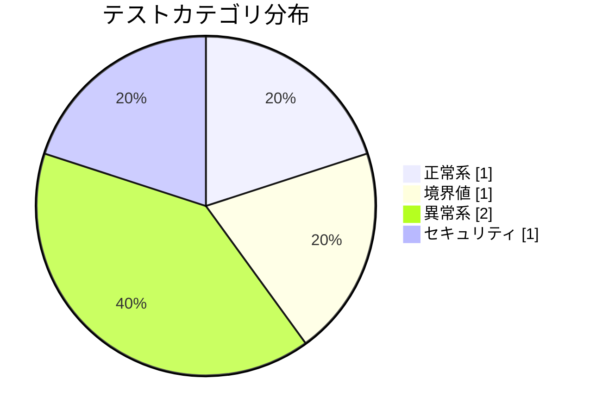
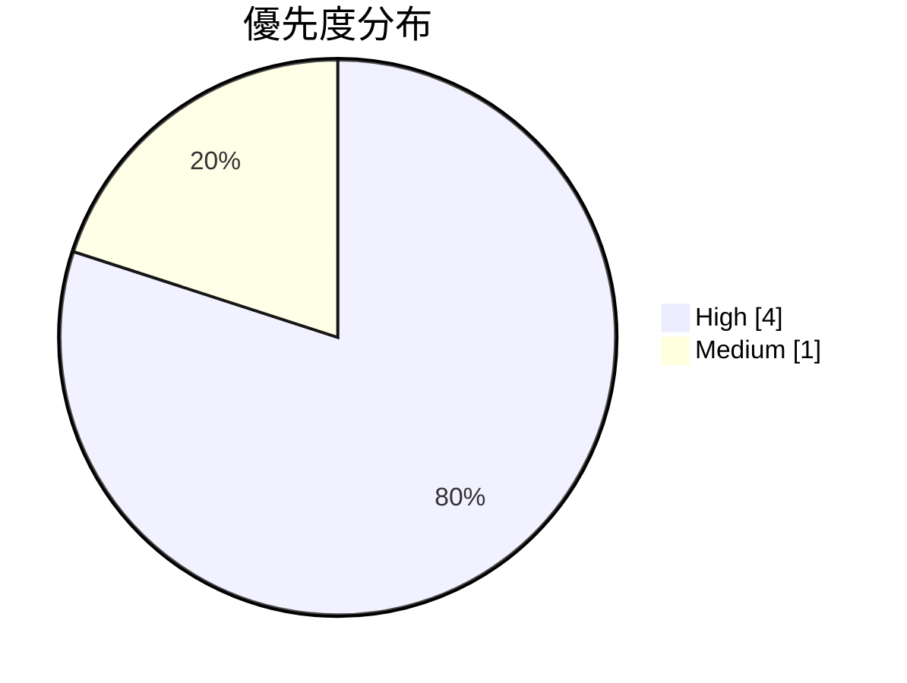

# ログイン機能の動作確認計画

**タイプ:** 📋 動作確認計画 | **ステータス:** 🔄 WIP | **バージョン:** 1.0.0
**作成者:** 山田太郎

## テスト対象

**対象機能:** ユーザーログイン機能
**関連PR:** https://github.com/example/project/pull/456
**テスト環境:** ステージング環境

**関連ドキュメント:**
- design/requirements/login_requirements.yaml
- development/implementation_plan/login_impl.yaml

## スコープ

### テスト対象
- メールアドレス/パスワードによるログイン
- ログイン失敗時のエラー表示
- ログイン成功後のリダイレクト
- セッション管理

### テスト対象外
- ソーシャルログイン（別PR）
- パスワードリセット（別PR）

## 事前条件

- ✅ ステージング環境にデプロイ済み
- ✅ テストユーザーアカウントを作成済み
- ⬜ Redisサーバーが稼働中

## テストケース

| ID | タイトル | カテゴリ | 優先度 |
|----|----------|----------|--------|
| TC-001 | 正常ログイン | 🔵 正常系 | 🔴 high |
| TC-002 | 無効なパスワードでログイン失敗 | 🔴 異常系 | 🔴 high |
| TC-003 | 存在しないユーザーでログイン | 🔴 異常系 | 🔴 high |
| TC-004 | 空のフォームで送信 | 🟡 境界値 | 🟡 medium |
| TC-005 | SQLインジェクション対策確認 | 🔒 セキュリティ | 🔴 high |

### TC-001: 正常ログイン

**事前条件:** 有効なユーザーアカウントが存在する

**手順:**
1. ログインページにアクセス
2. メールアドレスを入力
3. パスワードを入力
4. ログインボタンをクリック

**期待結果:** ダッシュボードにリダイレクトされる

### TC-002: 無効なパスワードでログイン失敗

**事前条件:** 有効なユーザーアカウントが存在する

**手順:**
1. ログインページにアクセス
2. 正しいメールアドレスを入力
3. 間違ったパスワードを入力
4. ログインボタンをクリック

**期待結果:** エラーメッセージ「メールアドレスまたはパスワードが正しくありません」が表示される

### TC-003: 存在しないユーザーでログイン

**事前条件:** なし

**手順:**
1. ログインページにアクセス
2. 存在しないメールアドレスを入力
3. 任意のパスワードを入力
4. ログインボタンをクリック

**期待結果:** エラーメッセージ「メールアドレスまたはパスワードが正しくありません」が表示される

### TC-004: 空のフォームで送信

**事前条件:** なし

**手順:**
1. ログインページにアクセス
2. 何も入力せずにログインボタンをクリック

**期待結果:** バリデーションエラー「メールアドレスは必須です」が表示される

### TC-005: SQLインジェクション対策確認

**事前条件:** なし

**手順:**
1. ログインページにアクセス
2. メールアドレスに「' OR '1'='1」を入力
3. パスワードに「' OR '1'='1」を入力
4. ログインボタンをクリック

**期待結果:** ログインに失敗し、エラーメッセージが表示される
