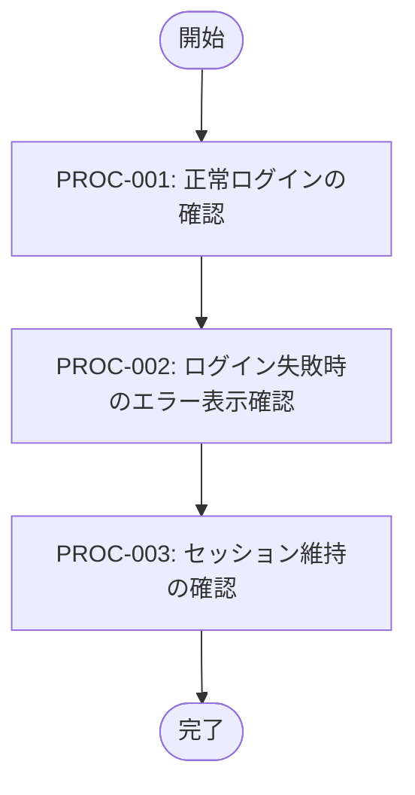

# ログイン機能の動作確認手順

**タイプ:** 📝 動作確認手順 | **ステータス:** 🔄 WIP | **バージョン:** 1.0.0
**作成者:** 山田太郎
**この doc_type の役割:** 動作確認・検証の手順を記述する。

## 背景

ログイン機能のリリースに伴い、動作確認手順を文書化する。

## 目的

この資料ではログイン機能の動作確認手順と期待結果を定義する。

### 関連ドキュメント

- [動作確認計画](../../verification_plan/human/document.md)

**関連計画:** categories/verification/verification_plan/ai/document.yaml
**テスト環境:** ステージング環境（https://staging.example.com）

## テストフロー

## PROC-001: 正常ログインの確認

**事前条件:** テストユーザー（test@example.com / Test1234!）が作成済み

### 手順

**1. ブラウザで https://staging.example.com/login を開く**

   期待結果: ログインフォームが表示される
   備考: Chrome最新版を使用

**2. メールアドレス欄に「test@example.com」を入力**

   期待結果: 入力値が表示される

**3. パスワード欄に「Test1234!」を入力**

   期待結果: パスワードがマスク表示される

**4. 「ログイン」ボタンをクリック**

   期待結果: ローディングインジケータが表示される

**5. 画面遷移を待つ**

   期待結果: ダッシュボード（/dashboard）にリダイレクトされる
   備考: 3秒以内に遷移すること

**事後条件:** ユーザーセッションが作成されている

## PROC-002: ログイン失敗時のエラー表示確認

**事前条件:** なし

### 手順

**1. ブラウザで https://staging.example.com/login を開く**

   期待結果: ログインフォームが表示される

**2. メールアドレス欄に「test@example.com」を入力**

   期待結果: 入力値が表示される

**3. パスワード欄に「WrongPassword」を入力**

   期待結果: パスワードがマスク表示される

**4. 「ログイン」ボタンをクリック**

   期待結果: エラーメッセージ「メールアドレスまたはパスワードが正しくありません」が赤字で表示される
   備考: パスワード欄はクリアされること

**事後条件:** ログインページに留まっている

## PROC-003: セッション維持の確認

**事前条件:** PROC-001でログイン済み

### 手順

**1. 新しいタブで https://staging.example.com/profile を開く**

   期待結果: プロフィールページが表示される（ログイン状態が維持されている）

**2. ブラウザを閉じて再度開く**

   期待結果: ブラウザが閉じられる
   備考: Remember me機能がOFFの場合

**3. https://staging.example.com/dashboard を開く**

   期待結果: ログインページにリダイレクトされる

**事後条件:** セッションが無効化されている

## 関連資料（エビデンス）

- [動作確認計画](../../verification_plan/human/document.md)
- [動作確認手順・関連計画](https://github.com)

---

[プロジェクト概要に戻る](../../../overview/project_summary/human/document.md)