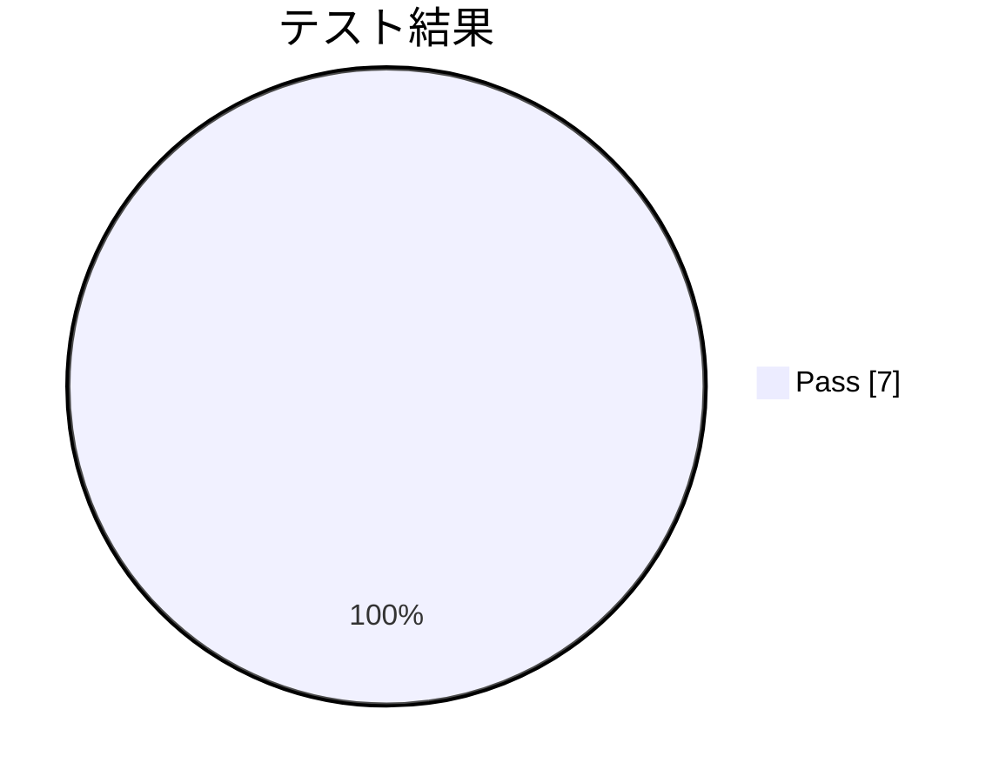

# リフレッシュトークン実装 動作確認結果

**タイプ:** ✅ 動作確認結果 | **ステータス:** ✅ Done | **バージョン:** 1.0.0
**作成者:** 佐藤花子
**この doc_type の役割:** 動作確認・検証の結果を記録する。

**対象機能:** リフレッシュトークンローテーション
**関連PR:** https://github.com/example/auth-service/pull/456
**テスト環境:** staging

## テスト結果

| ID | タイトル | 結果 |
|----|----------|------|
| TC-001 | 正常系: リフレッシュトークンで新トークンを取得 | ✅ pass |
| TC-002 | 正常系: 旧リフレッシュトークンが無効化される | ✅ pass |
| TC-003 | 異常系: 期限切れトークンでエラー | ✅ pass |
| TC-004 | 異常系: 不正なトークン形式 | ✅ pass |
| TC-005 | セキュリティ: トークン再利用でファミリー全体が無効化 | ✅ pass |
| TC-006 | 境界値: 有効期限ギリギリでのリフレッシュ | ✅ pass |
| TC-007 | 性能: 連続リフレッシュのレスポンスタイム | ✅ pass |

## サマリー

**実行日時:** 2024-02-05 14:30
**実行者:** 佐藤花子

| 合計 | Pass | Fail | Blocked | Skipped | 合格率 |
|------|------|------|---------|---------|--------|
| 7 | ✅ 7 | ❌ 0 | 🚫 0 | ⏭️ 0 | 100.0% |

### 結論

全テストケースがPassしました。
リフレッシュトークンローテーション機能は正常に動作しています。
本番リリース可能と判断します。

## 関連資料（エビデンス）

- [動作確認結果・関連PR](https://github.com)

---

[プロジェクト概要に戻る](../../../overview/project_summary/human/document.md)