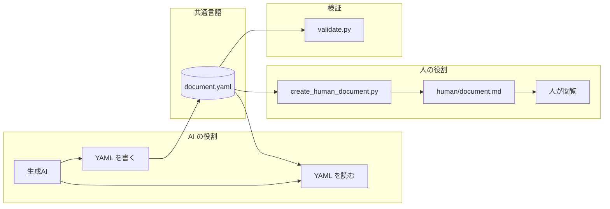
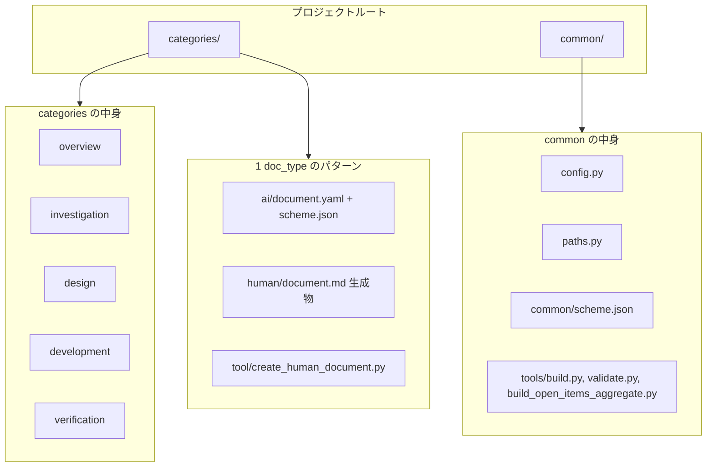
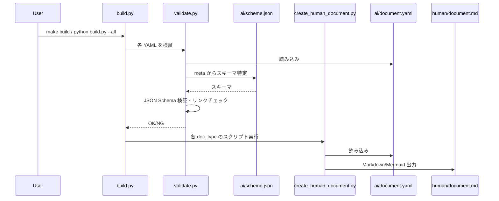
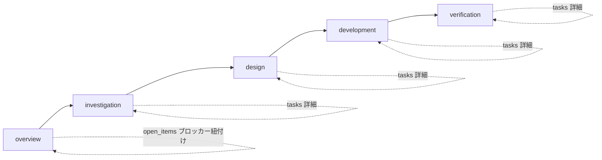
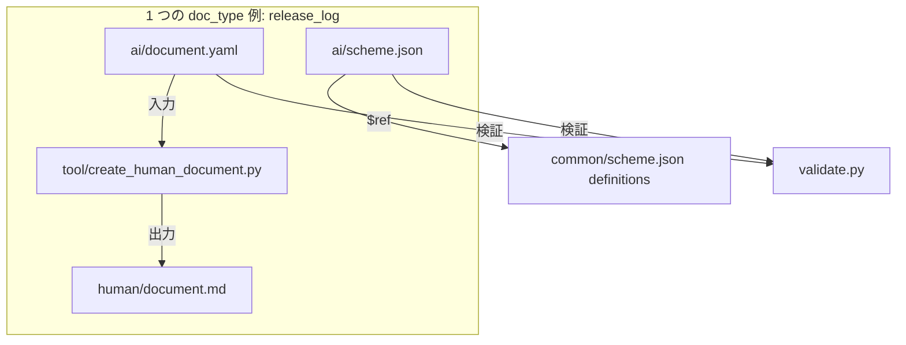
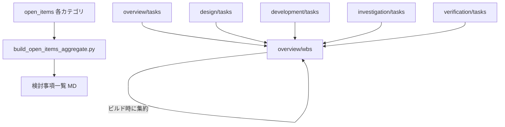

# このプロジェクトについて

本プロジェクトは「Documentation as Code」の考え方に沿い、YAML を生成 AI と人間の共通言語として使い、開発案件のドキュメントを管理するツールです。詳細な思想は [思想.md](思想.md) を、使い方・カテゴリ一覧は [README.md](../README.md) を参照してください。

---

## Documentation as Code との対応

- **ソースがコード（YAML）**: 要件・設計・実装メモなどは `ai/document.yaml` に構造化して記述し、`ai/scheme.json` で形式を規定する。
- **ビルドで人間用ドキュメントを生成**: 各 doc_type の `tool/create_human_document.py` が YAML を読み、`human/document.md` や Mermaid 図を生成する。
- **検証**: `validate.py` で YAML をスキーマ検証し、リンクチェックも行う。
- **役割の分離**: AI は YAML の読み書き、人はツールが生成した Markdown/図の閲覧に専念する（[思想.md](思想.md) の通り）。

| 概念 | このプロジェクトでの対応 |
|------|---------------------------|
| ドキュメントをテキスト/構造で管理 | YAML ＋ スキーマで管理 |
| バージョン管理 | Git で管理可能 |
| 自動検証 | `validate.py` |
| ビルド/生成 | `build.py` → Markdown / Mermaid 生成 |

---

## 1. 思想・役割分担

生成 AI は YAML を読み・書く。人はツールで生成した Markdown / Mermaid だけを閲覧する。生成 AI が書いた YAML は検証スクリプトでバリデートする。



---

## 2. ディレクトリ構造

各 doc_type は **ai/**（document.yaml + scheme.json）、**human/**（document.md・ビルド成果物）、**tool/**（create_human_document.py）の 3 点セット。common には config / paths / scheme の共通定義と、build / validate / build_open_items_aggregate を配置する。



### 1 つの doc_type の例（release_log）

```
categories/overview/release_log/
  ai/
    document.yaml    # AI が編集するソース
    scheme.json      # バリデーション用スキーマ
  human/
    document.md      # ビルドで生成される人間向け Markdown
  tool/
    create_human_document.py   # YAML → Markdown 変換スクリプト
```

---

## 3. ビルド・検証のデータフロー

validate.py が meta.category / meta.doc_type からスキーマを特定し `ai/scheme.json` で JSON Schema 検証（オプションでリンクチェック）。build.py が validate 実行後に各 doc_type の create_human_document.py を呼び出し、`human/document.md` を生成する。



---

## 4. カテゴリとフェーズの関係

overview → investigation → design → development → verification の順でフェーズが進む。タスク・検討事項は各カテゴリの doc_type（tasks / open_items）で管理する。



---

## 5. doc_type の「3 点セット」とスキーマ

1 つの doc_type = ai（YAML + スキーマ）+ human（生成 MD）+ tool（変換スクリプト）。common/scheme.json の definitions を各 doc_type の `ai/scheme.json` が `$ref` で参照する。AI が書く場所は ai/document.yaml に一本化され、スキーマで形式が強制される。



---

## 6. タスク・検討事項の集約関係

- **タスク**: overview/wbs がサマリ・マイルストーンを保持。細かいタスクは各カテゴリの **tasks** に保持し、WBS のビルド時にカテゴリ別詳細タスクとして集約表示する。
- **検討事項・不明点**: 各カテゴリの **open_items** で管理。ブロッカーは project_summary または WBS の blockers で紐付ける。
- **build_open_items_aggregate.py**: 全カテゴリの open_items を 1 つの Markdown に集約し、PM が一覧で確認できるようにする。

doc_type ごとの「ai/document.yaml → tool → human/document.md」の依存関係（WBS・project_summary が他 YAML を参照する部分を含む）は [依存関係図.md](依存関係図.md) を参照。



タスク管理の詳細は [README.md](../README.md) の「タスク管理方針」を参照してください。
