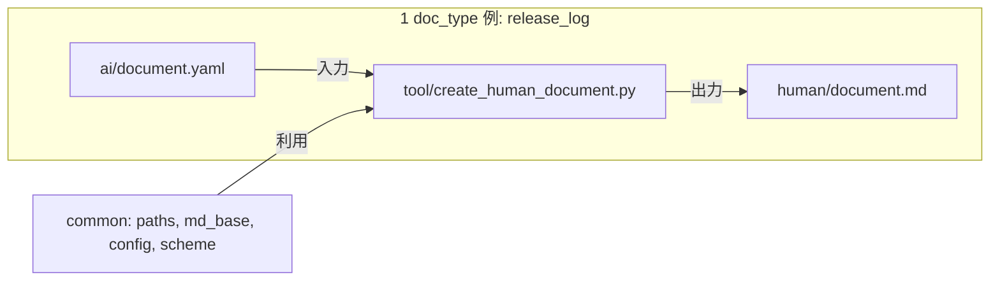
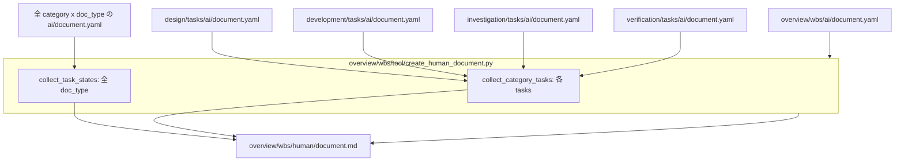
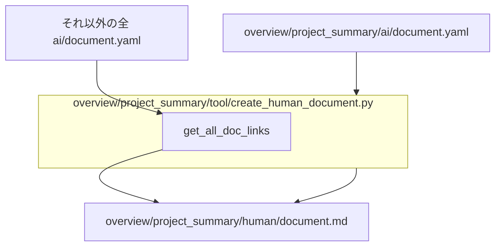
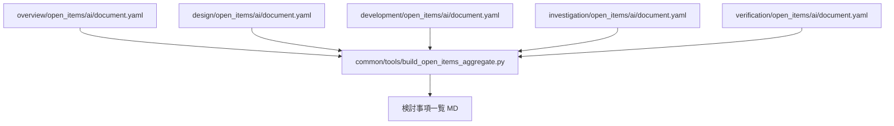
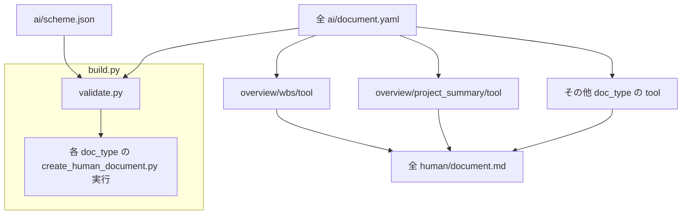

# doc_type と human/document.md の依存関係図

各 doc_type では `ai/document.yaml` を `tool/create_human_document.py` が読み、`human/document.md` を生成する。大多数は**単体変換**（自分の YAML のみ参照）だが、一部の doc_type は**他 doc_type の ai/document.yaml を tool で取得**し、その情報を human/document.md に含めて生成している。本ドキュメントではそれらを全て含めた依存関係を図示する。

参照: [ABOUT.md](ABOUT.md)、[README.md](../README.md)

---

## 1. 依存の種類

| 種類 | 説明 | 該当 doc_type / ツール |
|------|------|-------------------------|
| **単体変換** | 当該 doc_type の `ai/document.yaml` のみを読み、`human/document.md` を 1 件生成する。 | 大多数の doc_type（release_log, tasks, open_items, requirements など） |
| **他 YAML 参照して集約** | 自分の YAML に加え、他 doc_type の `ai/document.yaml` を tool で読み、human/document.md に集約表示する。 | overview/wbs、overview/project_summary |
| **common ツールによる集約** | doc_type の human/document.md ではなく、別の 1 つの Markdown を生成する。 | build_open_items_aggregate.py |

---

## 2. 図1 — 基本パターン（単体 doc_type）

1 つの doc_type あたり、自分の `ai/document.yaml` のみを `tool/create_human_document.py` が読み、`human/document.md` を 1 件出力する。common（paths, md_base, config, scheme）を利用する。

---

## 3. 図2 — overview/wbs の依存

WBS の `human/document.md` は、自分の `overview/wbs/ai/document.yaml` に加え、**全 (category, doc_type) の ai/document.yaml** を読み、ドキュメント状態・タスク一覧（「カテゴリ別タスク状態」）を集約する。さらに **design/tasks, development/tasks, investigation/tasks, verification/tasks** の各 `ai/document.yaml` を読み、「カテゴリ別詳細タスク」セクションを生成する。

---

## 4. 図3 — overview/project_summary の依存

project_summary の `human/document.md` は、自分の `overview/project_summary/ai/document.yaml` に加え、**自分以外の全 (category, doc_type) の ai/document.yaml** を `get_all_doc_links()` で読み、`meta.title` を取得して「カテゴリ別ドキュメント一覧」のリンクを生成する。

---

## 5. 図4 — build_open_items_aggregate

common ツール `build_open_items_aggregate.py` は、全カテゴリの `open_items/ai/document.yaml` を読み、1 つの集約 Markdown を生成する。出力先はオプション指定可能。各 doc_type の human/document.md とは別の成果物である。

---

## 6. 図5 — ビルド全体

`build.py` は各 YAML に対して validate を実行した後、当該 doc_type の create_human_document を実行する。WBS と project_summary のスクリプトは実行時に上記の他 YAML を読みにいくため、図2・図3の依存がここに統合される。

---

## 7. doc_type 別の依存一覧

| カテゴリ | doc_type | human/document.md の生成に参照する ai/document.yaml |
|----------|----------|------------------------------------------------------|
| overview | wbs | **自分 + 全 (category, doc_type)**（タスク状態用）+ **design/tasks, development/tasks, investigation/tasks, verification/tasks**（カテゴリ別詳細タスク用） |
| overview | project_summary | **自分 + 自分以外の全 (category, doc_type)**（リンク一覧のタイトル取得用） |
| 上記以外 | すべて | **当該 doc_type の ai/document.yaml のみ** |

集約系（他 YAML を tool で参照して human/document.md を生成する）は **overview/wbs** と **overview/project_summary** の 2 件のみ。
