# ログイン時のセッション重複バグ修正 - Mermaid図

## 修正フロー

バグ修正の全体フローです。

```mermaid
flowchart TD
    S["🐛 症状発見"]
    I["🔍 調査"]
    R["💡 原因特定"]
    F["🔧 修正実装"]
    V["✅ 検証"]
    D["🚀 デプロイ"]

    S --> I
    I --> R
    R --> F
    F --> V
    V --> D

    V -->|失敗| F

    style S fill:#ffcdd2
    style D fill:#c8e6c9
```

## なぜなぜ分析

根本原因を特定するための分析です。

```mermaid
flowchart TD
    W0{"Why: なぜセッションが残るのか？"}
    A0["SCANコマンドがタイムアウトして全セッショ..."]
    W0 --> A0
    A0 --> W1
    W1{"Why: なぜSCANがタイムアウトするのか？"}
    A1["セッションキーが多すぎてスキャンに時間がかかる"]
    W1 --> A1
    A1 --> W2
    W2{"Why: なぜセッションキーが多いのか？"}
    A2["有効期限切れのセッションが削除されずに蓄積している"]
    W2 --> A2
    A2 --> W3
    W3{"Why: なぜ有効期限切れセッションが削除されないのか？"}
    A3["RedisのTTL設定が漏れているセッションがある"]
    W3 --> A3
    A3 --> W4
    W4{"Why: なぜTTL設定が漏れるのか？"}
    A4["セッション作成時のTTL設定が条件分岐で一部..."]
    W4 --> A4
    A4 --> RC["🎯 根本原因"]
    style RC fill:#ffeb3b
```

## リスクマトリクス

深刻度と発生確率に基づくリスクの分布です。

```mermaid
quadrantChart
    title リスクマトリクス
    x-axis 発生確率 低 --> 高
    y-axis 深刻度 低 --> 高
    quadrant-1 要対策
    quadrant-2 監視
    quadrant-3 許容
    quadrant-4 注意
    "修正デプロイ時にログイン...": [0.17, 0.38]
    "クリーンアップバッチによ...": [0.50, 0.38]
```

