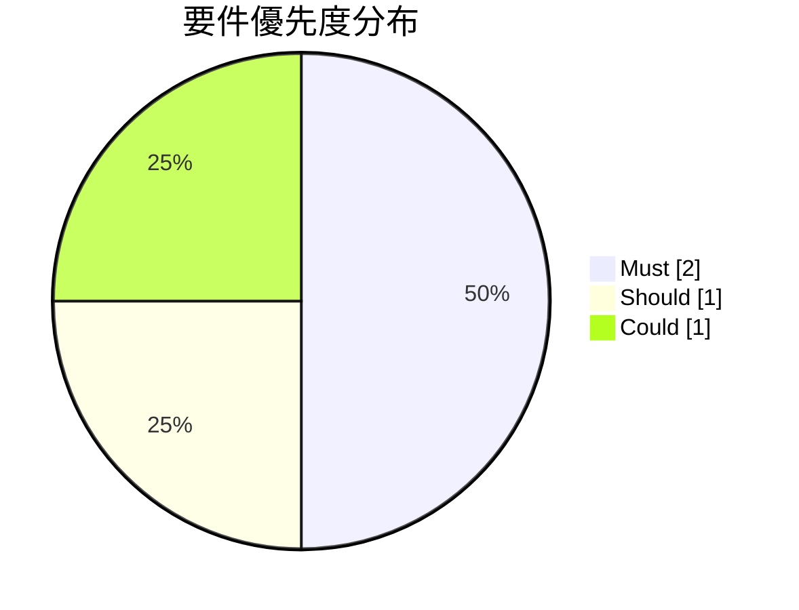
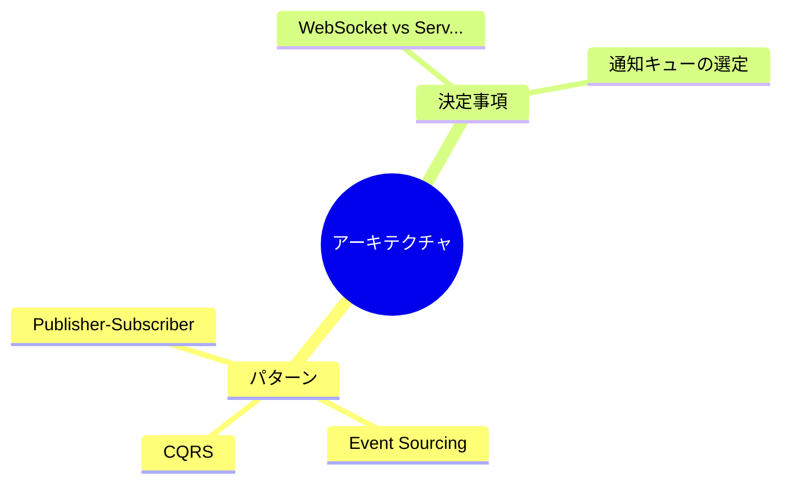
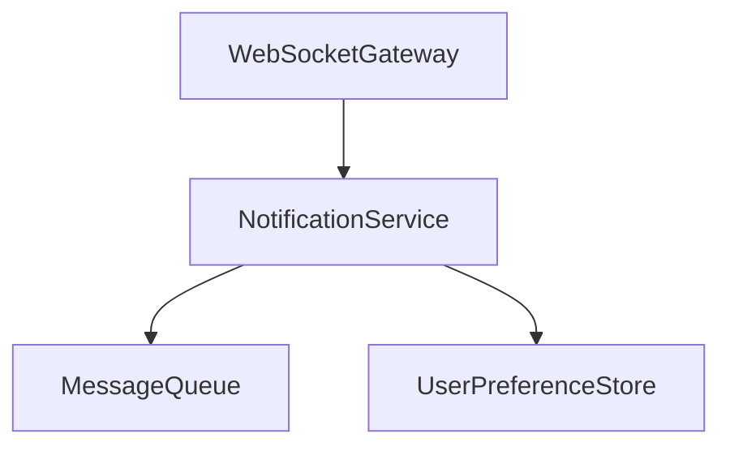
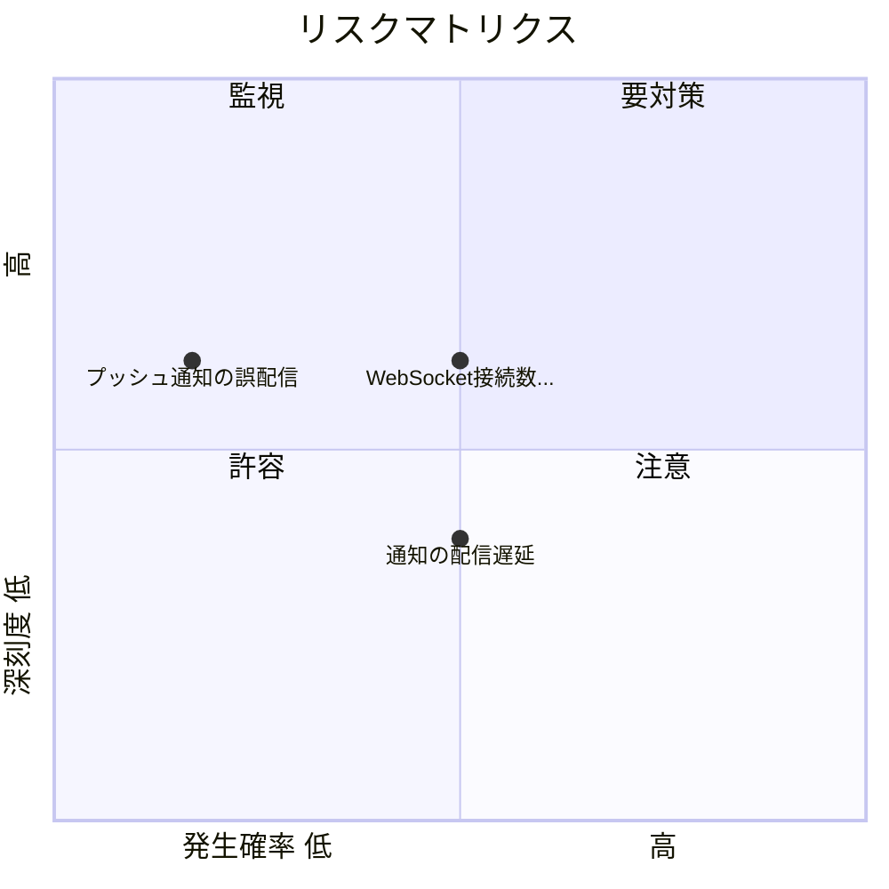

# ユーザー通知機能 - Mermaid図

## 要件優先度

機能要件の優先度分布です。

```mermaid
pie showData
    title 要件優先度分布
    "Must" : 2
    "Should" : 1
    "Could" : 1
```

## アーキテクチャ

アーキテクチャの概要です。

```mermaid
mindmap
  root((アーキテクチャ))
    パターン
      Publisher-Subscriber
      Event Sourcing
      CQRS
    決定事項
      WebSocket vs Serv...
      通知キューの選定
```

## コンポーネント構成

コンポーネント間の依存関係です。

```mermaid
flowchart TB
    C0["NotificationService"]
    C1["WebSocketGateway"]
    C2["MessageQueue"]
    C3["UserPreferenceStore"]

    C0 --> C2
    C0 --> C3
    C1 --> C0
```

## リスクマトリクス

深刻度と発生確率に基づくリスクの分布です。

```mermaid
quadrantChart
    title リスクマトリクス
    x-axis 発生確率 低 --> 高
    y-axis 深刻度 低 --> 高
    quadrant-1 要対策
    quadrant-2 監視
    quadrant-3 許容
    quadrant-4 注意
    "WebSocket接続数...": [0.50, 0.62]
    "通知の配信遅延": [0.50, 0.38]
    "プッシュ通知の誤配信": [0.17, 0.62]
```
