# Kubernetes移行プロジェクト - Mermaid図

## インフラ構成

目標のインフラ構成です。

```mermaid
flowchart TB
    subgraph container["📦 コンテナ"]
        COMP0["API Server<br/>EKS (Kuberne..."]
        COMP1["Worker<br/>EKS (Kuberne..."]
    end

    subgraph network["🌐 ネットワーク"]
        COMP2["Ingress<br/>AWS ALB Ingr..."]
    end

    subgraph database["🗄️ データベース"]
        COMP3["RDS<br/>Aurora MySQL"]
    end

    subgraph cache["💾 キャッシュ"]
        COMP4["ElastiCache<br/>Redis"]
    end

    COMP0 --> COMP3
    COMP0 --> COMP4
    COMP1 --> COMP3
    COMP2 --> COMP0
```

## 移行フロー

移行ステップとロールバック手順です。

```mermaid
flowchart TD
    Start([🚀 移行開始])
    Step1["1. EKSクラスター構築とネットワーク設定"]
    Start --> Step1
    Rollback1[/"🔙 クラスター削除"/]
    Step1 -.-> Rollback1
    Step2["2. CI/CDパイプラインの構築（GitHub Actio..."]
    Step1 --> Step2
    Rollback2[/"🔙 旧デプロイパイプラインに戻す"/]
    Step2 -.-> Rollback2
    Step3["3. ステージング環境での動作検証"]
    Step2 --> Step3
    Rollback3[/"🔙 該当なし"/]
    Step3 -.-> Rollback3
    Step4["4. 本番環境へのブルー/グリーンデプロイ（10%トラフィック）"]
    Step3 --> Step4
    Rollback4[/"🔙 トラフィックを旧環境に100%戻す"/]
    Step4 -.-> Rollback4
    Step5["5. トラフィックを段階的に移行（10% → 50% → 1..."]
    Step4 --> Step5
    Rollback5[/"🔙 トラフィック比率を戻す"/]
    Step5 -.-> Rollback5
    Step6["6. 旧EC2環境の停止・削除"]
    Step5 --> Step6
    Rollback6[/"🔙 EC2インスタンスを再起動"/]
    Step6 -.-> Rollback6
    End([✅ 移行完了])
    Step6 --> End

    style Start fill:#e1f5fe
    style End fill:#c8e6c9
```

## コスト内訳

月額コストの内訳です。

```mermaid
pie showData
    title コスト内訳
    "EKS Control Plane" : 73
    "EC2 (Node Group)" : 500
    "ALB" : 50
    "CloudWatch" : 100
    "データ転送" : 200
    "その他（ECR, Secrets Manager等）" : 77
```

## リスクマトリクス

深刻度と発生確率に基づくリスクの分布です。

```mermaid
quadrantChart
    title リスクマトリクス
    x-axis 発生確率 低 --> 高
    y-axis 深刻度 低 --> 高
    quadrant-1 要対策
    quadrant-2 監視
    quadrant-3 許容
    quadrant-4 注意
    "Kubernetes学習コスト": [0.83, 0.38]
    "移行中のサービス障害": [0.17, 0.62]
    "想定外のコスト増加": [0.50, 0.38]
```

