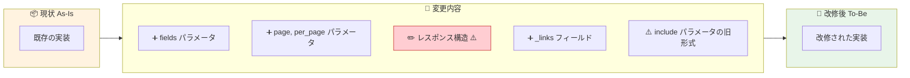
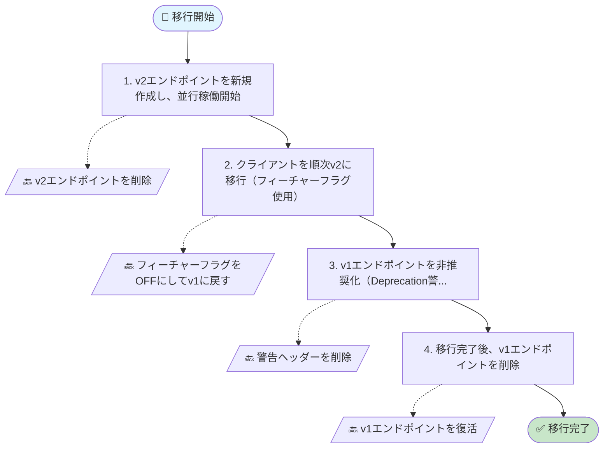
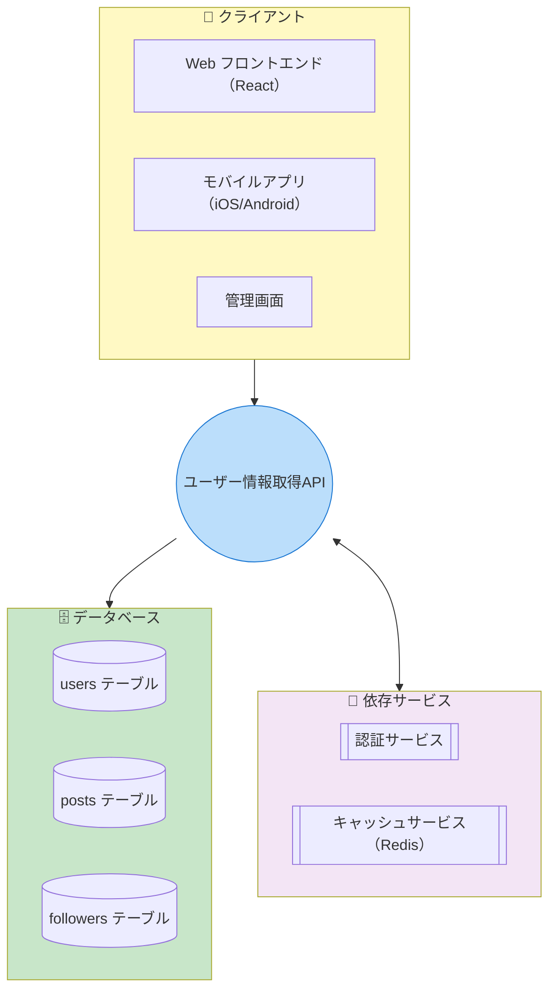
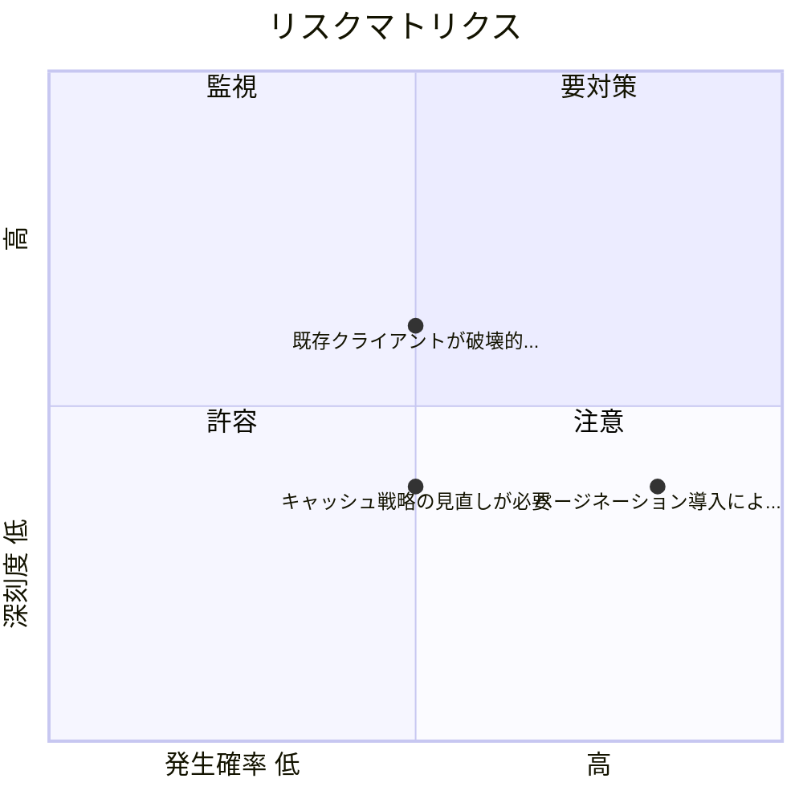
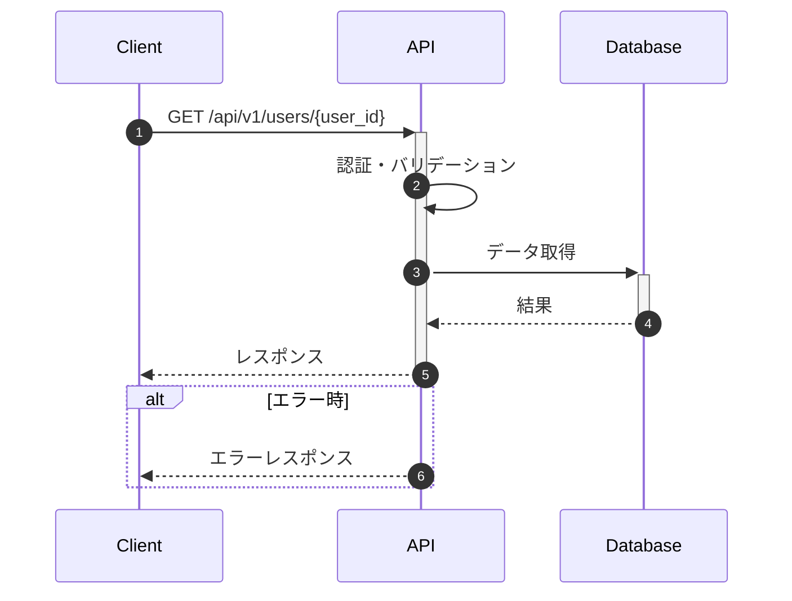

# ユーザー情報取得API改修 - Mermaid図

## 変更サマリー

As-Is（現状）から To-Be（改修後）への変更の概要です。

## 移行フロー

移行ステップとロールバック手順です。

## 影響範囲

この改修が影響するシステムの範囲です。

## リスクマトリクス

深刻度と発生確率に基づくリスクの分布です。

## APIフロー

APIリクエスト/レスポンスの流れです。

