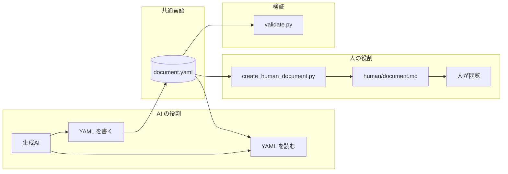
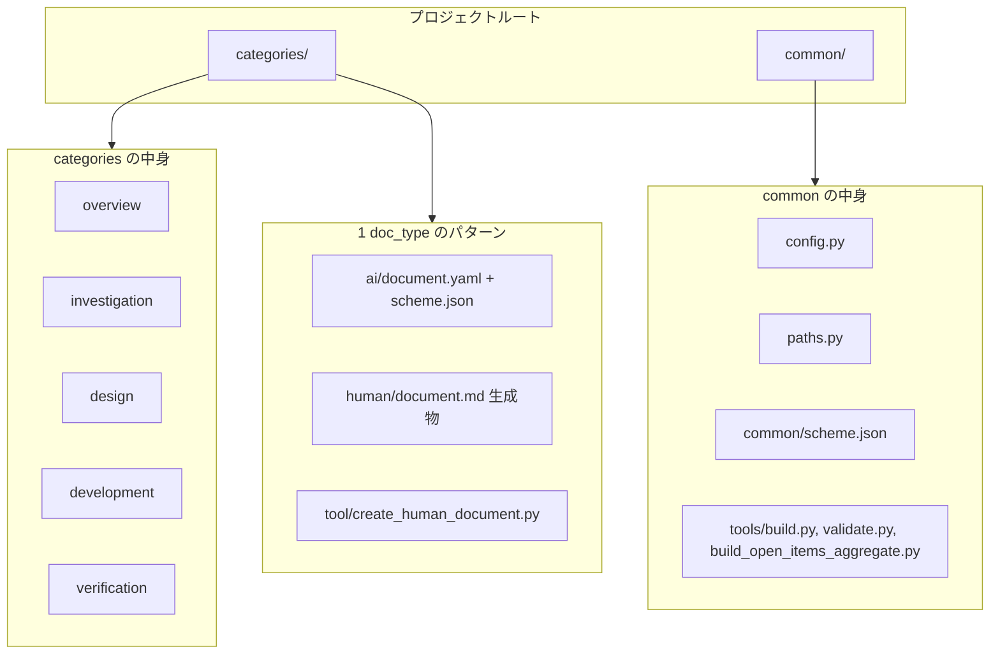
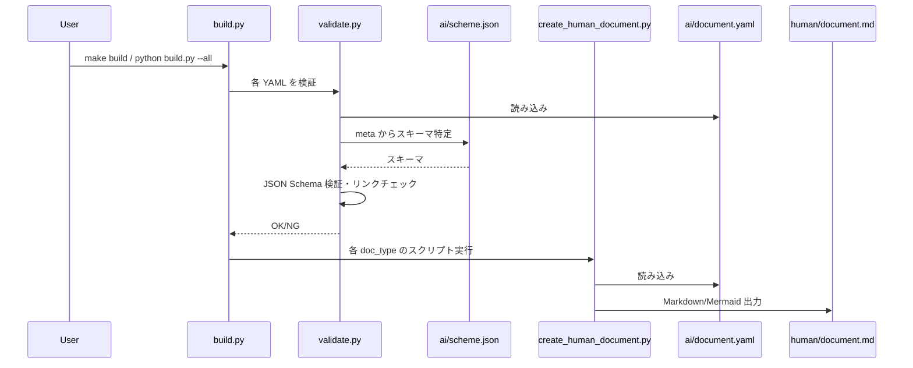
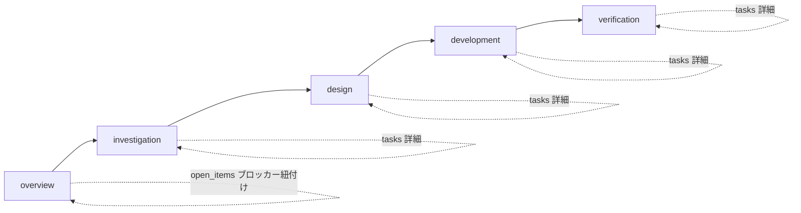
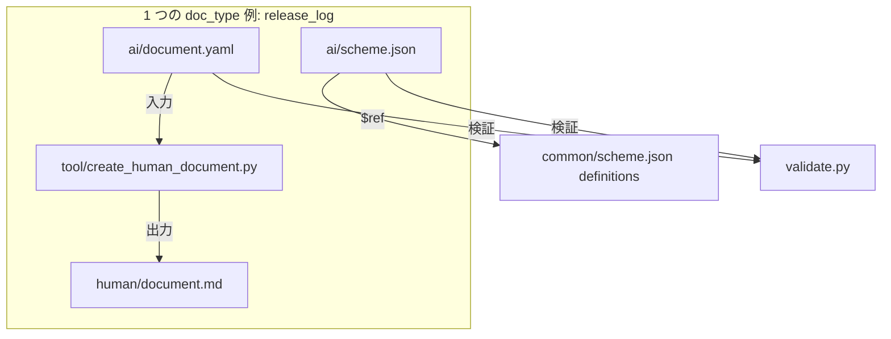
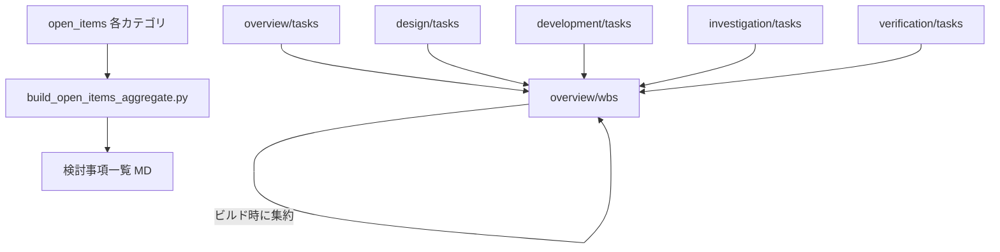

# プロジェクト構造・考え方（図解）

このドキュメントでは、本プロジェクトの「思想」「ディレクトリ構造」「データフロー」「カテゴリ・doc_type の関係」「ツールの役割」を Mermaid 図で整理しています。詳細な文章説明は [思想.md](思想.md) と [README.md](README.md) を参照してください。

---

## 1. 思想・役割分担

**AI と人間の共通言語としての YAML**

- 生成 AI は YAML を読み・書く（共通言語として扱う）。
- 人はツールで生成した Markdown / Mermaid だけを閲覧する。
- 生成 AI が書いた YAML は検証スクリプトでバリデートする。



---

## 2. ディレクトリ構造

**`categories/{category}/{doc_type}/` と `common/` の関係**

- 各 doc_type は **ai/**（document.yaml + scheme.json）、**human/**（document.md・ビルド成果物）、**tool/**（create_human_document.py）の 3 点セット。
- common には config / paths / scheme の共通定義と、build / validate / build_open_items_aggregate を配置。



### 1 つの doc_type のディレクトリ例（release_log）

```
categories/overview/release_log/
  ai/
    document.yaml    # AI が編集するソース
    scheme.json      # バリデーション用スキーマ
  human/
    document.md      # ビルドで生成される人間向け Markdown
  tool/
    create_human_document.py   # YAML → Markdown 変換スクリプト
```

---

## 3. ビルド・検証のデータフロー

**YAML → バリデーション → Markdown 生成**

- validate.py: meta.category / meta.doc_type からスキーマを特定し、`ai/scheme.json` で JSON Schema 検証。オプションでリンクチェック（GitHub URL、生成済み MD 内の相対パス）。
- build.py: 全 YAML またはカテゴリ指定で、validate 実行後に各 doc_type の `tool/create_human_document.py` を呼び出し、`human/document.md` を生成。



---

## 4. カテゴリとフェーズの関係

**overview → investigation → design → development → verification**

ドキュメント参照の推奨順は、カテゴリの並びの通り。各カテゴリはフェーズに対応し、タスク・検討事項は各カテゴリの doc_type（tasks / open_items）で管理する。



---

## 5. doc_type の「3 点セット」とスキーマ

**1 つの doc_type = ai（YAML + スキーマ）+ human（生成 MD）+ tool（変換スクリプト）**

- common/scheme.json の definitions（meta_base, overview_background_goal, ai_context 等）を各 doc_type の `ai/scheme.json` が `$ref` で参照。
- 変換は doc_type ごとの `create_human_document.py` が YAML を読み、Markdown と Mermaid を組み立てる。AI が書く場所は ai/document.yaml に一本化され、スキーマで形式が強制される。



---

## 6. タスク・検討事項の集約関係

**WBS とカテゴリ tasks / open_items の関係**

- **タスクの正**: overview/wbs がサマリ・マイルストーンを保持。細かいタスクは各カテゴリの doc_type: **tasks** に保持し、WBS のビルド時にカテゴリ別詳細タスクとして集約表示する。
- **検討事項・不明点**: 各カテゴリの **open_items** で管理。ブロッカーは project_summary または WBS の blockers で紐付ける。
- **build_open_items_aggregate.py**: 全カテゴリの open_items を 1 つの Markdown に集約し、PM が検討事項・不明点を一覧で確認できるようにする。



---

## 関連ドキュメント

- [思想.md](思想.md) … YAML を介した共通言語・改善できること
- [README.md](README.md) … 使い方・カテゴリと doc_type・タスク管理方針
- [doc_as_code.md](doc_as_code.md) … ドキュメントのコード化の対応関係
